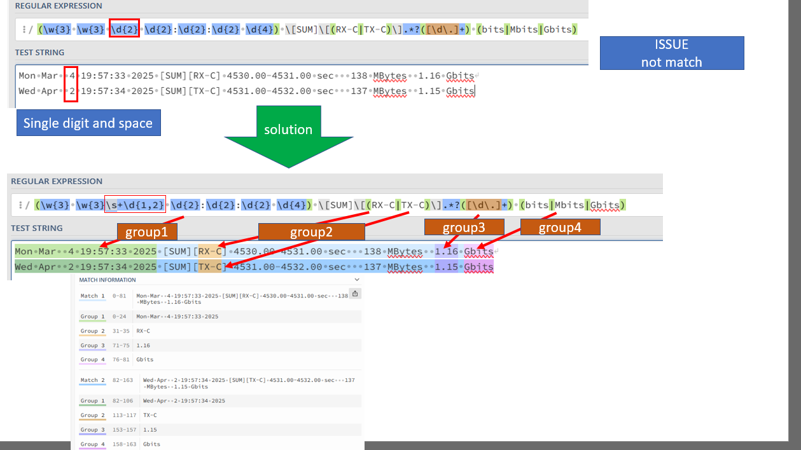
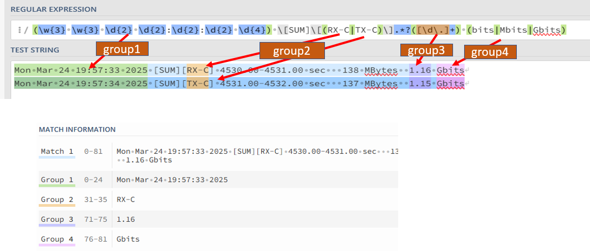

# Parse with bidirectional iperf Log

## Description of Code
This script is used to parse the iperf bidirectional Log with string `[SUM][RX-C]` and `[SUM][TX-C]` and capture the datetime, TPUT, and unit. 
> iperf3 command: `iperf3 -c <IP-ADD> -P 32 -t <second> --bidir -b 36M `

Bidirectional mean run both UL(upload) and DL(Download) in the same time, so it will occur TX and RX string in iperf log, and I want to parse that string. 


## Output

- bidirectional write result to excel


- bidirectional write result to excel and draw graph


## Code Version explanation

### V2 Implement excel with plot graph 

- Implement plot graph, and restructure the code

**Output**
```
PS C:\gitfile\5G_automation\Iperflog_parser\3.parse_bidirectional> py .\bidirectional_exel_graph.py
Enter your log filename (e.g., iperf3.log): iperf3_bidirectional.log
Enter base name for output files (press Enter for default):
--------------------------------------------------
Attempting to open log file: iperf3_bidirectional.log
Parsing log file...
Reading Log: 100%|██████████████████████████████████████████████████████████████████| 352M/352M [00:10<00:00, 33.1MB/s]
Parsing complete. Found 50091 RX entries and 50092 TX entries.
Writing RX-DL: 100%|███████████████████████████████████████████████████████| 50091/50091 [00:00<00:00, 86822.56 rows/s]
Writing TX-UL: 100%|███████████████████████████████████████████████████████| 50092/50092 [00:00<00:00, 68586.58 rows/s]
--------------------------------------------------
Saving Excel file to 2025-05-07_16-17-10_iperf3_bidirectional_analysis.xlsx... Please wait.
Data successfully written to 2025-05-07_16-17-10_iperf3_bidirectional_analysis.xlsx
--------------------------------------------------
Generating plot for RX-DL...
Saving plot to 2025-05-07_16-17-10_iperf3_bidirectional_analysis_RX-DL_plot.png...
RX-DL plot saved successfully.
--------------------------------------------------
Generating plot for TX-UL...
Saving plot to 2025-05-07_16-17-10_iperf3_bidirectional_analysis_TX-UL_plot.png...
TX-UL plot saved successfully.
--------------------------------------------------
Moving generated files to folder: 2025-05-07_iperf3_bidirectional_analysis
Ensured folder '2025-05-07_iperf3_bidirectional_analysis' exists.
File '2025-05-07_16-17-10_iperf3_bidirectional_analysis.xlsx' moved to '2025-05-07_iperf3_bidirectional_analysis\2025-05-07_16-17-10_iperf3_bidirectional_analysis.xlsx'.
File '2025-05-07_16-17-10_iperf3_bidirectional_analysis_RX-DL_plot.png' moved to '2025-05-07_iperf3_bidirectional_analysis\2025-05-07_16-17-10_iperf3_bidirectional_analysis_RX-DL_plot.png'.
File '2025-05-07_16-17-10_iperf3_bidirectional_analysis_TX-UL_plot.png' moved to '2025-05-07_iperf3_bidirectional_analysis\2025-05-07_16-17-10_iperf3_bidirectional_analysis_TX-UL_plot.png'.
--------------------------------------------------
Calculating Durations:
RX-DL => Start Time: 2025-05-05 18:31:49
RX-DL => End Time:   2025-05-06 08:26:54
RX-DL => Running duration: 0 days, 13 hours, 55 minutes, 5 seconds (Total: 50105s)
TX-UL => Start Time: 2025-05-05 18:31:49
TX-UL => End Time:   2025-05-06 08:26:55
TX-UL => Running duration: 0 days, 13 hours, 55 minutes, 6 seconds (Total: 50106s)
--------------------------------------------------
Script finished.
PS C:\gitfile\5G_automation\Iperflog_parser\3.parse_bidirectional>
```

### V1.3 Remove replicate reading file progress
- passing rx and tx into process_log_file_to_excel_rx_tx
Seem like it will reading log file two time, which is not efficiently, so I remove it 

```
def process_log_file_to_excel_rx_tx(rx_data, tx_data, output_excel_file):
	.....

rx_data, tx_data = parse_log_file_rx_tx(input_file_path) #will parse the tx and rx result
#pass the tx and tx data into process_log_file_to_excel_rx_tx so it will not have redo this again. 
process_log_file_to_excel_rx_tx(rx_data, tx_data, output_excel_file_path)
```
- rename the excel filename by datetime
```
datename=datetime.now().strftime("%Y-%m-%d_%H-%M-%S")
input_file_path = input('Enter your filename(ex:iperf3_bidirectional.log): ')
output_excel_file_path = (input('save exel file name (enter for default) : ') )
```

**output:**
```
Enter your filename(ex:iperf3_bidirectional.log): iperf3_bidirectional.log
save exel file name (enter for default) :
--------------------------------------------------
Reading File: 100%|█████████████████████████████████████████████████████████████████| 352M/352M [00:10<00:00, 32.9MB/s]
Writing to RX-DL: 100%|███████████████████████████████████████████████████████| 50091/50091 [00:00<00:00, 90787.26it/s]
Writing to TX-UL: 100%|███████████████████████████████████████████████████████| 50092/50092 [00:00<00:00, 86360.10it/s]
--------------------------------------------------
Saving Excel file... Please wait.
Data written to 2025-05-06_14-57-52_output_rx_tx.xlsx
Folder '2025-05-06_14-58-13' created.
File '2025-05-06_14-57-52_output_rx_tx.xlsx' moved to '2025-05-06_14-58-13\2025-05-06_14-57-52_output_rx_tx.xlsx'.
--------------------------------------------------
RX-DL => Running duration: 0 days, 13 hours, 55 minutes
RX-DL => Converted hours: 13 hours
TX-UL => Running duration: 0 days, 13 hours, 55 minutes
TX-UL => Converted hours: 13 hours
```

### V1.2 adding matching one digit date

- Resolve Issue 001: Fixed parsing single digit datetime


**output:**
```
--------------------------------------------------
PS C:\Users\test\Desktop\iperflogparser\bidirectional> py bidirectional_v2.py
Reading File: 100%|██████████████████████████████████████████| 341M/341M [00:12<00:00, 27.5MB/s]
Reading File: 100%|██████████████████████████████████████████| 341M/341M [00:15<00:00, 21.9MB/s]
Writing to RX-DL: 100%|████████████████████████████████████████| 48259/48259 [00:00<00:00, 53948.44it/s]
Writing to TX-UL: 100%|████████████████████████████████████████| 48402/48402 [00:00<00:00, 60566.06it/s]
--------------------------------------------------
Saving Excel file... Please wait.
Data written to output_rx_tx.xlsx
Folder '2025-03-25_15-55-52' created.
File 'output_rx_tx.xlsx' moved to '2025-03-25_15-55-52\output_rx_tx.xlsx'.
--------------------------------------------------
RX-DL => Running duration: 0 days, 13 hours, 27 minutes
RX-DL => Converted hours: 13 hours
TX-UL => Running duration: 0 days, 13 hours, 27 minutes
TX-UL => Converted hours: 13 hours
```

#### Capture matching string

If your date occur only one digit with space, then in v1.1 will not work, to fix this issue change from `\d{2}` to `\s+\d{1,2}`

```
def parse_log_file_rx_tx(input_file):
	match = re.match(r"(\w{3} \w{3}\s+\d{1,2} \d{2}:\d{2}:\d{2} \d{4}) \[SUM]\[(RX-C|TX-C)\].*?([\d\.]+) (bits|Mbits|Gbits)/sec", line_str)
	....
```



- `d{2}`: looks for exactly two digits.
- `d{1,2}`: more flexible and looks for either one or two digits.
- `\s`: space 


#### convert Tput value mbit to gbit 

```
def parse_log_file_rx_tx(input_file):
	.....
    if unit == "Mbits":
        transfer_value /= 1000.0
    elif unit == "bits":
        transfer_value /= 1000000000.0
    # Append data    
        if rx_tx == "RX-C":
            rx_data.append([formatted_date, transfer_value, "gbps"])
        else:
            tx_data.append([formatted_date, transfer_value, "gbps"])
```

#### calculate duration time 

Move calculate duration time to the bottom main section
```
def process_log_file_to_excel_rx_tx(input_file, output_excel_file):
	if rx_data:
		calculate_and_print_duration(rx_data, 'RX-DL')
	if tx_data:
		calculate_and_print_duration(tx_data,'TX-UL')
```
- main section
```
rx_data, tx_data = parse_log_file_rx_tx(input_file_path) # parse the data first    
process_log_file_to_excel_rx_tx(input_file_path, output_excel_file_path)
moving_file(input_file_path, output_excel_file_path)
print('--------------------------------------------------')
if rx_data:
    calculate_and_print_duration(rx_data, 'RX-DL')
if tx_data:
    calculate_and_print_duration(tx_data, 'TX-UL')
```


### v1.1 inital 

#### Capture matching string

> - parse log file: `[SUM][RX-C]` or `[SUM][TX-C]`
```
def parse_log_file_rx_tx(input_file):
	.....
	#parse matching string
	for line in lines:
		match = re.match(r"(\w{3} \w{3} \d{2} \d{2}:\d{2}:\d{2} \d{4}) \[SUM]\[(RX-C|TX-C)\].*?([\d\.]+) (M|G)bits/sec", line)
		if match:
			date_str = match.group(1)#datetime
			rx_tx = match.group(2)#parse rx or tx string
			transfer_str = match.group(3)#tput value
			unit = match.group(4) #unit		
```


#### convert datetime from log to date format
```
def parse_log_file_rx_tx(input_file):
	.....
	date_obj = datetime.strptime(date_str, "%a %b %d %H:%M:%S %Y")
	formatted_date = date_obj.strftime("%Y%m%d_%H:%M:%S")
	transfer_value = float(transfer_str)
	.....
```
#### progress bar 


Initial Wait show count instead of progress bar, remove this method 

```
#old version will show number counting 
def parse_log_file_rx_tx(input_file):
    rx_data = []
    tx_data = []
    with open(input_file, 'r', encoding='utf-8', errors='ignore') as infile:
        total_lines = 0
        with tqdm(desc="Counting Lines") as counting_pbar:
            for _ in open(input_file, 'r', encoding='utf-8', errors='ignore'):
                total_lines += 1
                counting_pbar.update(1)

        with tqdm(total=total_lines, desc="Processing Log File") as pbar:
            for line in infile:
                match = re.match(r"(\w{3} \w{3} \d{2} \d{2}:\d{2}:\d{2} \d{4}) \[SUM]\[(RX-C|TX-C)\].*?([\d\.]+) (M|G)bits/sec", line)
                if match:
                    date_str = match.group(1)
                    rx_tx = match.group(2)
                    transfer_str = match.group(3)
                    unit = match.group(4)
                    try:
                        date_obj = datetime.strptime(date_str, "%a %b %d %H:%M:%S %Y")
                        formatted_date = date_obj.strftime("%Y%m%d_%H:%M:%S")
                        transfer_value = float(transfer_str)
                        if unit == "M":
                            transfer_value /= 1000.0
                        if rx_tx == "RX-C":
                            rx_data.append([formatted_date, transfer_value, "gbps"])
                        else:
                            tx_data.append([formatted_date, transfer_value, "gbps"])
                    except ValueError:
                        print(f"Warning: Invalid data format in line: '{line}'. Skipping.")
                pbar.update(1)
    return rx_data, tx_data
```


#### convert Tput value mbit to gbit 
```
def parse_log_file_rx_tx(input_file):
	.....
	if unit == "M":
		transfer_value /= 1000.0
	if rx_tx == "RX-C":
		rx_data.append([formatted_date, transfer_value, "gbps"])
	else:
		tx_data.append([formatted_date, transfer_value, "gbps"])
	.....		
```
#### write into excel
```
def write_data_to_excel_rx_tx():
	header = ["Datetime", "Tput", "Unit"]
	sheet.append(header)
	for row in data:
		sheet.append(row)          
```
#### adjust width for datetime
```
def adjust_column_width(sheet):
	#Adjusts the first column's width.
	def adjust_column_width(sheet):
		datetime_column = sheet['A']
		max_length = 0
		for cell in datetime_column:
			try:
				if len(str(cell.value)) > max_length:
					max_length = len(str(cell.value))
			except TypeError:
				pass
		adjusted_width = max_length + 2
		sheet.column_dimensions['A'].width = adjusted_width
```

#### calculate duration time
```
start_time_str = data[0][0]
end_time_str = data[-1][0]

start_time = datetime.strptime(start_time_str, "%Y%m%d_%H:%M:%S")
end_time = datetime.strptime(end_time_str, "%Y%m%d_%H:%M:%S")

duration = end_time - start_time
total_seconds = int(duration.total_seconds())

days = total_seconds // (24 * 3600)
remaining_seconds = total_seconds % (24 * 3600)
hours = remaining_seconds // 3600
remaining_seconds %= 3600
minutes = remaining_seconds // 60
print(f"{item} => Running duration: {days} days, {hours} hours, {minutes} minutes")
print(f"{item} => Converted hours: {days * 24 + hours} hours")
```
#### main section: set default output file 
```
if output_excel_file_path == '':
    output_excel_file_path = f"{filewithDate}_output_mbit_Result.xlsx"
else:
    output_excel_file_path=output_excel_file_path+'.xlsx'
```
