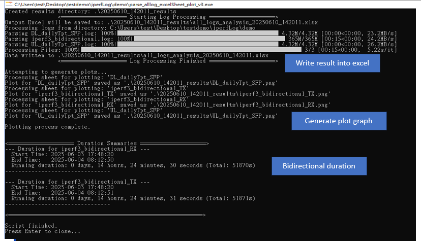
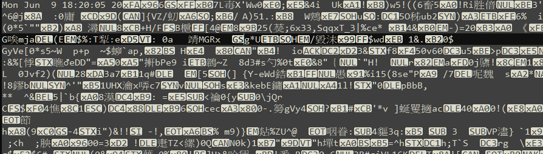

# Parse log working directory 

## Description

Process multiple log files in a directory, extract SUM lines, convert transfer rates to Gbits/sec,
formats data, and writes to separate sheets in an Excel file.

This code user doesn't have to enter the logfile, it will parse all the logfiles or txt files inthe  current working directory. 

- `parse_alllog_excelSheet_plot_v3.py`: include bidirectional log([SUM][TX-C] or [SUM][RX-C]) and plot graph


## output
It will check the current working directory for files containing `.txt` and `.log` and parse, but if the content contains [RX-C] [TX-C] which is a bidirectional log then it will skip this logfile




## version update
- v1: 
	- v1.1: parse unit gbit and mbit
		- Run the current working directory file that contains log or txt file will read the file and parse data
		- If the unit is M then it will convert the unit to G, ex: 1000 then it will change to 1 
		- Remove the unit
		- NOT SUPPORT bidirectional 
		- [Issue 001]: 0.00 bit not able to filter
	- v1.2: Capture 0.00 bit  
		- fix issue: adding 0.00 bit is also able to parse
		- [Isssue 002]: two digit and space for date will not be captured
	- v1.3: ignore log contains tx or RX 
		- if log contains tx or tx then ignore that file(bidirectional)
	- v1.4: capture date with space and digit 
		- fix issue: Capture space with two digit for date `add \\s+\\d{1,2}`
- v2.1: 
	- Plot data into line graph: log contain [SUM] [RX-C] or [SUM] [TX-C] skip and will not plot graph and write into excel
	- Create result into folder: all the result will move into new folder
- v2.2: 
	- Implement [SUM] [RX-C] or [SUM] [TX-C]  result 
	- Improvement X axis: adding time condition determine interval instead of static interval 
- v3: 
	- Fix when log contain some wrong binary corrupted data
	- Improvement Y-axis  Calculate Dynamic Y-axis Limit
	- remove  plot_from_excel_simple_adjusted_old function
	- rename images name as `{sheet_name}.png`, orignal use png_output_path `tput_adjusted_{sheet_name}.png`


### v1 intial release parse all log or txt file 

- check current directory for log and txt file 
```
def process_log_files_to_excel(directory_path, output_excel_file):
workbook = openpyxl.Workbook()
file_list = [f for f in os.listdir(directory_path) if f.endswith((".txt", ".log"))]  # Get .txt and .log files
# Delete the default sheet if it exists
if "Sheet" in workbook.sheetnames:
	del workbook["Sheet"]
if not file_list:
    print(f"No .txt or .log files found in directory: {directory_path}")
		return
```

- parse and capture a [SUM] string for UL DL undirectional log
```
with open(input_file_path, 'r') as infile:
	for line in lines:
		if "[SUM]" in line:
		# Modified regex to capture bits/sec, Mbits/sec, and Gbits/sec
		match = re.match(r"(\w{3} \w{3} \d{2} \d{2}:\d{2}:\d{2} \d{4}) \[SUM\].*?([\d\.]+) (bits|Mbits|Gbits)/sec",line)
		if match:
			date_str = match.group(1)
			transfer_str = match.group(2)
			unit = match.group(3)
```
- parse and capture [SUM][RX-C] or [SUM][TX-C] for bidirectional log
```
with open(input_file_path, 'r') as infile:
	for line in lines:
		if "[SUM][RX-C]" in line or "[SUM][TX-C]" in line:
			print(f"\nSkipping {filename}: Contains RX/TX data.")
			rx_tx_found = True
			break  # Skip to the next file
		if "[SUM]" in line:
			# Modified regex to capture bits/sec, Mbits/sec, and Gbits/sec
			match = re.match(r"(\w{3} \w{3}\s+\d{1,2} \d{2}:\d{2}:\d{2} \d{4}) \[SUM\].*?([\d\.]+) (bits|Mbits|Gbits)/sec",line)
```
- convert unit if match mbit or bit 
To make Tput consistency we need to convert data unit into gbit type
```
# Convert to Gbits/sec
transfer_value = float(transfer_str)
	if unit == "Mbits":
		transfer_value /= 1000.0  # Convert Mbits to Gbits
    elif unit == "bits":
		transfer_value /= 1000000000.0 # Convert bits to Gbits
    sheet.append([formatted_date, transfer_value, 'gbps'])
```

### v2.1 plot graph 
- plot graph

adjust x axis for datetime with interval (data divide by interval in below 50, which will show how many x axis)
>  `plt.xticks( np.linspace(0, len(datetime_col)-1, 50 ),rotation=90, ha='right' )`	

```
all_sheets_data = pd.read_excel(excel_file, sheet_name=None)
    for sheet_name, df in all_sheets_data.items():
        if 'Datetime' in df.columns and 'Tput' in df.columns:
            # Ensure 'Datetime' is treated as string for direct display
            df['Datetime'] = pd.to_datetime(df['Datetime'], errors='coerce', format='%Y%m%d_%H:%M:%S')
            df['Tput'] = pd.to_numeric(df['Tput'], errors='coerce')
            df.dropna(subset=['Datetime', 'Tput'], inplace=True)  # Remove rows with NaT or NaN
            
			#CHECK FOR EMPTY DATA (rx and tx data will contain header)
            if df.empty:
                print(f"Sheet '{sheet_name}' contains no valid data after cleaning. Skipping plot generation for this sheet.")
                continue # Skip to the next sheet
			
			plt.figure(figsize=(12, 5), dpi=150) # Adjust figure size if needed
            plt.plot(datetime_col, tput_col, label='Tput')
            plt.xlabel('Time')
            plt.ylabel('Throughput (gbps)')
            plt.title(f'Throughput - {sheet_name}')
            plt.legend()
            plt.grid(True)
            # Set y-axis limits
            plt.ylim(0, 4)
            # Display full datetime on x-axis
            #plt.xticks(rotation=45, ha='right')
            plt.xticks( np.linspace(0, len(datetime_col)-1, 50 ),rotation=90, ha='right' )
            plt.tight_layout()
            plt.savefig(f"tput_adjusted_{sheet_name}.png")
            plt.close()
            print(f"Adjusted plot for {sheet_name} saved.")
        else:
            print(f"Warning: Sheet '{sheet_name}' missing 'Datetime' or 'Tput' co
```

you can also use minute or hour as interval 
```
df['Datetime'] = pd.to_datetime(df['Datetime'], errors='coerce', format='%Y%m%d_%H:%M:%S')
df.dropna(subset=['Datetime', 'Tput'], inplace=True)
fig, ax = plt.subplots(figsize=(12, 5), dpi=150) # Use subplots for date formatting
ax.plot(datetime_col, tput_col, label='Tput')
ax.set_xlabel('Time')
ax.set_ylabel('Throughput (gbps)')
ax.set_title(f'Throughput - {sheet_name}')
ax.legend()
ax.grid(True)
.....
plt.tight_layout()
plt.savefig(f"tput_adjusted_{sheet_name}.png")
plt.close()
```

### v2.2 Dynamic Plotting Adjustments
If your data log file contain time as 15 minute, then it might 


- Static Plot x axis (v2.1)
> `mdates.AutoDateLocator(maxticks=200)`:  aim for up to 200 major ticks.
```
def plot_from_excel_simple_adjusted_old()
	
    fig, ax = plt.subplots(figsize=(12, 5), dpi=150)
    ax.plot(datetime_col, tput_col, label='Tput')
    ax.set_xlabel('Time')
    ax.set_ylabel('Throughput (gbps)')
    ax.set_title(f'Throughput - {sheet_name}')
    ax.legend()
    ax.grid(True)
    ax.set_ylim(0, 4.5) #y axis range
    locator = mdates.AutoDateLocator(maxticks=200)
    formatter = mdates.DateFormatter('%Y-%m-%d %H:%M:%S')
    ax.xaxis.set_major_locator(locator)
    ax.xaxis.set_major_formatter(formatter)
    plt.xticks(rotation=45, ha='right')

```
- adjust Dynamic x axis
```
def plot_from_excel_simple_adjusted():
	# Adjust figure size and locator based on total_duration
	if total_duration <= timedelta(minutes=5): # Very short spans (e.g., few minutes)
		fig_width = 14
		major_locator = mdates.SecondLocator(interval=10) # Ticks every 10 seconds (up to ~30 labels)
	elif total_duration <= timedelta(minutes=15): # Your 902-second log falls here
		fig_width = 16 # Wider plot for more labels
		major_locator = mdates.SecondLocator(interval=30) # Ticks every 30 seconds (approx 30 labels for 15 mins)
		# If you want even more (e.g., ~60 labels), change interval to 15, and consider making fig_width even larger
	elif total_duration <= timedelta(minutes=30): # Up to 30 minutes
		fig_width = 18
		major_locator = mdates.MinuteLocator(interval=1) # Ticks every 1 minute
	elif total_duration <= timedelta(hours=2): # Up to 2 hours
		fig_width = 14
		major_locator = mdates.MinuteLocator(interval=5) # Ticks every 5 minutes
	elif total_duration <= timedelta(hours=6): # Up to 6 hours
		fig_width = 16
		major_locator = mdates.MinuteLocator(interval=15) # Ticks every 15 minutes
	#Greater than 6hrs, less than or equal to 24hrs timedelta(days=1)
	elif total_duration <= timedelta(days=1): # Up to 24 hours (e.g., overnight logs like your 14hr case)
		fig_width = 20 # Increased width to accommodate more labels
		major_locator = mdates.MinuteLocator(interval=30) # Ticks every 30 minutes
		# For a 14-hour log, this will give ~28 labels (14*2)
		# For a 24-hour log, this will give ~48 labels (24*2)
	elif total_duration <= timedelta(days=3): # Up to 3 days
		fig_width = 20
		major_locator = mdates.HourLocator(interval=3) # Ticks every 3 hours
	elif total_duration <= timedelta(days=7): # Up to 7 days
		fig_width = 22
		major_locator = mdates.DayLocator(interval=1) # Ticks every 1 day
	else: # More than 7 days
		fig_width = 25
		major_locator = mdates.DayLocator(interval=7) # Ticks every 7 days (weekly)
	
```


### V3 
- remove plot_from_excel_simple_adjusted_old function
- rename images name as `{sheet_name}.png`, orignal use png_output_path `tput_adjusted_{sheet_name}.png`
- Fix Corrupted data binary part

If your log contain something like corrupted data log, the script will occur error, and stop. Like below:


To fix this we need to change:
```
def process_log_files_to_excel(directory_path, output_excel_file):
	.......
	with open(input_file_path, 'rb') as infile: # Open in binary mode
		# tqdm to show progress of reading bytes for parsing
		with tqdm(total=total_file_size, unit='B', unit_scale=True, desc=f"Parsing {filename}") as pbar:
			for raw_line in infile: # Read raw byte lines
				pbar.update(len(raw_line)) # Update progress based on bytes read
				# Decode each raw line, ignoring unmappable characters
				line = raw_line.decode('utf-8', errors='ignore')
				.....			
```

- Calculate Dynamic Y-axis Limit for better visual
```
# --- Calculate Dynamic Y-axis Limit ---
max_tput = tput_col.max()
y_upper_limit = max(max_tput * 1.10, 1.0) # Ensure a minimum upper bound for readability
if max_tput > 4.0 and y_upper_limit < 5.0:
    y_upper_limit = 5.0
..........
ax.set_ylim(0, y_upper_limit)
```