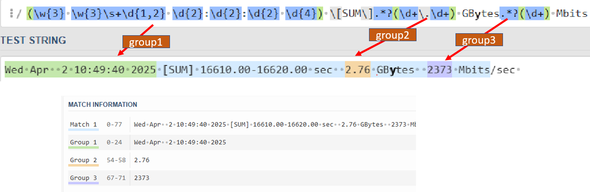

# Parse mbit log file with mbit

## Description
This script is use to parse Mbit log file, which can filter GBytes and Mbits this two string argument and write into excel.

## Output
If you enter the logfile contain gbit will show Error telling you this code only can capture mbit logfile


## Code explanation

### Capture matching string
```
match = re.match(r"(\w{3} \w{3}\s+\d{1,2} \d{2}:\d{2}:\d{2} \d{4}) \[SUM\].*?(\d+\.\d+) GBytes.*?(\d+) Mbits/sec", line)
if match:
    date_str = match.group(1) #datetime
    transfer_str = match.group(2)#GBytes value
    bitrate_str = match.group(3)#Mbit value
```


### convert datetime 
```
try:
    date_obj = datetime.strptime(date_str, "%a %b %d %H:%M:%S %Y")
    formatted_date = date_obj.strftime("%Y%m%d_%H:%M:%S")
    data.append([formatted_date, float(transfer_str), int(bitrate_str)])
except ValueError:
    print(f"Warning: Invalid date format in line: '{line}'. Skipping.")
                            
except AttributeError:
    print(f"Warning: could not parse bitrate in line: '{line}'. Skipping.")
```

### write into excel
```
if data:            
    workbook = openpyxl.Workbook()
    sheet = workbook.active
    sheet.append(["Datetime", "GBytes", "Mbits/sec"])  # Header row
        for row in data:
            sheet.append(row)
		#adjust column width 
        adjust_column_width(sheet)
        workbook.save(output_excel_file)
        print(f"Data written to {output_excel_file}")
```

### adjust width for datetime

```
def adjust_column_width(sheet):

    datetime_column = sheet['A']
    max_length = 0
    for cell in datetime_column:
        try:
            if len(str(cell.value)) > max_length:
                max_length = len(str(cell.value))
        except TypeError:
            pass
    adjusted_width = max_length + 2
    sheet.column_dimensions['A'].width = adjusted_width
```