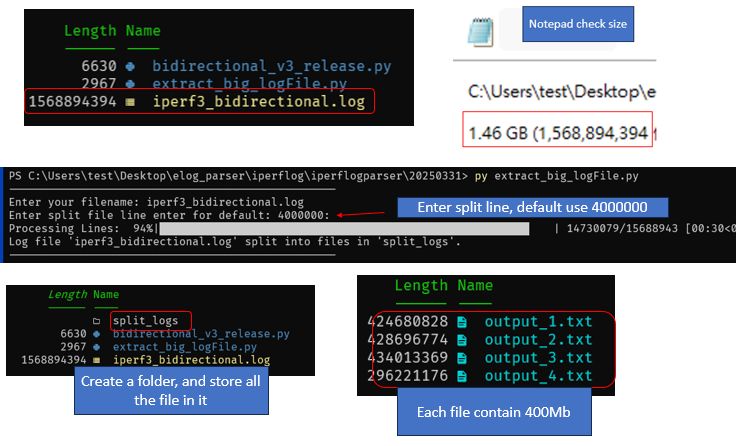

# Extract big LogFile

## Description 
This script will read your original logfile (big file), and  and splits it into multiple smaller text files. 
If you have a big logfile for example more than 1Gb or 2GB some editor tool might not able to open file. For example like notepad or notepad++ it might not be able to open. To solve this problem, you can split a large file to multiple smaller file. 

In this code I split the file to `4000000` line as default, however you can also assign how many line. Split line `4000000` is about 400MB for each file





## Code explanation

### default line to split 

```
if filelinesplit == '':
    filelinesplit = 4000000  # Assign 4000000 to filelinesplit
    
else:
    try:
        filelinesplit = int(filelinesplit)  # Convert to integer if not empty
    except ValueError:
        print("Invalid input. Using default value.")
        filelinesplit = 4000000
```