# Iperf Log parser and convert the result
This is an automation to parse or filter the iperf3 log file and write the Throughput into an Excel or TXT file. 

## 2. Updated record 
- 2025.3.16: inital 
- 2025.3.17: 
	- Change original parse_gbps_toexcel.py to parse_mbit_excel
	- adding datecalc.py for calculating the start to end datetime
- 2025.4.6: adding readme for each code, and fixing some bug
- 2025.4.10: update iperf related file, python file, exe file, fix md error, adding toc link
- 2025.05.p7: update bidirectional file
	- rename `bidirectional.py` to `bidirectional_excel.py` to 
	- improvement `bidirectional_exel_graph.py`: replicate reading log in code, remove it, so will occur reading file one time
	- create `bidirectional_exel_graph.py`: implement plot data to graph and reorganize code structure
## Content
- [1. LogFile Structure](#1.LogFileStructure)
	- [1.1 input_Gbits.txt use for run throughput log](#1.1)
	- [1.2 input_Mbits.txt use for stability test log](#1.2)
	- [1.3 iperf3_bidirectional_0bit_test.txt use for stability test log](#1.3)
	- [1.4 All log comparison](#1.4)
- 2. [2. Python File Overview](#2.pythonCode)
	- [2.1 parse_mbit_to_gb_excel: Parse both mbit and gbit and write result to excel ](#2.1) 
	- [2.2 Parse_mbit_to_excel: Parse mbit logFile and write result to excel without convert value to gb](#2.2) 
	- [2.3 Parse_bidirectional: Parse bidrectional log and write result to excel on different sheet](#2.3) 
	- [2.4 Parse_log_workingdir: Parse All log file and write result to excel in different sheet](#2.4)
	- [2.5 parse_result_txt: Parse and export result to txt file](#2.5) 
	- [2.6 parse_GBytes_mbit_toexcel: Parse log contain Mbits and GBytes value and save to excel](#2.6) 
	- [2.7 Split_LargeFile_smallFile: Split large logfile into smaller file](#2.7) 
	- [2.8 debug using ](#2.8) 
- 3. [3.Code Explantion on each feature](#3)
	- [3.1 parser regular expression](#3.1)
	- [3.2 convert datetime](#3.2)
	- [3.3 parse result and save to txt file](#3.3)
	- [3.4 write result into excel](#3.4)
	- [3.5 Dynamically set the header](#3.5)
	- [3.6 Excel remove default sheet and create new sheet](#3.6)
	- [3.7 Adjust the width of first column](#3.7)
	- [3.8 Add progress bar](#3.8)
	- [3.9 Error while reading](#3.8)
- 4. [Summary](#4)

<a name="1.LogFileStructure"></a>
## 1. Log File Structure [🔝](#Content)

- [1.1 input_Gbits.txt use for run throughput log](#1.1)
- [1.2 input_Mbits.txt use for stability test log](#1.2)
- [1.3 iperf3_bidirectional_0bit_test.txt use for stability test log](#1.3)
- [1.4 All log comparison](#1.4)

<a name="1.1"></a>
### Filename: `input_Gbits.txt` use for run throughput log [🔙](#1.LogFileStructure)

- **Iperf command**: `iperf3 -c <IP Addr>  -i 1 -f m -w 2m -P 32 -t 0 -t <seconds> --timestamp --logfile <logname>`
- **Log output**:
	```
	Thu Mar 13 10:04:31 2025 [SUM]   0.00-1.01   sec   277 MBytes  2.30 Gbits/sec                  
	Thu Mar 13 10:04:32 2025 [SUM]   1.01-2.01   sec   284 MBytes  2.38 Gbits/sec                  
	Thu Mar 13 10:04:33 2025 [SUM]   2.01-3.01   sec   283 MBytes  2.37 Gbits/sec    
	```
 
- **screenshot**:
    
	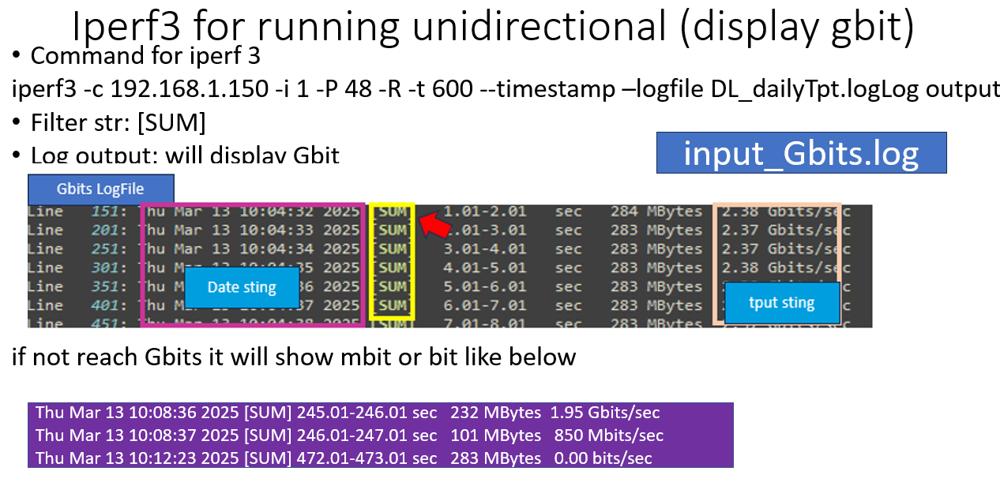 
	
<a name="1.2"></a>	
### Filename: `input_Mbits.txt` use for stability test log [🔙](#1.LogFileStructure)
- Iperf command: `iperf3 -c  <IP Addr>  -i 1 -P 48 -R -t <seconds> --timestamp --logfile <logname> `
- Log output: 
	```
	Mon Mar 10 18:47:06 2025 [SUM]   0.00-10.00  sec  2.76 GBytes  2368 Mbits/sec                  
	Mon Mar 10 18:47:16 2025 [SUM]  10.00-20.02  sec  2.61 GBytes  2236 Mbits/sec                  
	Mon Mar 10 18:47:26 2025 [SUM]  20.02-30.01  sec  2.76 GBytes  2372 Mbits/sec                  
	Mon Mar 10 18:47:36 2025 [SUM]  30.01-40.01  sec  2.41 GBytes  2073 Mbits/sec      
	```
- screenshot:
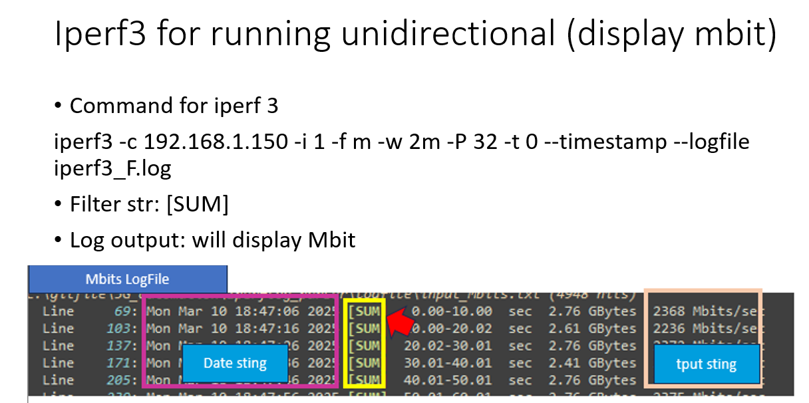

<a name="1.3"></a>	
### Filename: `iperf3_bidirectional_0bit_test.txt` use for stability test log [🔙](#1.LogFileStructure)
- **Iperf command**: `iperf3 -c <IP-ADD> -P 32 -t 2400 --bidir -b 36M -t <seconds> --timestamp --logfile <logname>`
- **Log output**: 
	```
	Mon Mar 24 19:57:33 2025 [SUM][TX-C] 4530.00-4531.00 sec   138 MBytes  1.16 Gbits/sec                  
	Mon Mar 24 19:57:33 2025 [SUM][RX-C] 4530.00-4531.00 sec   138 MBytes  1.16 Gbits/sec                  
	Mon Mar 24 19:57:34 2025 [SUM][TX-C] 4531.00-4532.00 sec   137 MBytes  1.15 Gbits/sec            
	Mon Mar 24 20:10:00 2025 [SUM][TX-C] 5277.00-5278.00 sec   136 MBytes  1.14 Gbits/sec                  
	Mon Mar 24 20:10:00 2025 [SUM][RX-C] 5277.00-5278.00 sec   113 MBytes   945 Mbits/sec       
	Mon Mar 24 19:57:34 2025 [SUM][RX-C] 4531.00-4532.00 sec   133 MBytes  1.11 Gbits/sec                  
	Mon Mar 24 20:33:23 2025 [SUM][TX-C] 6680.01-6681.00 sec  0.00 Bytes  0.00 bits/sec  
	```
- **screenshot**:

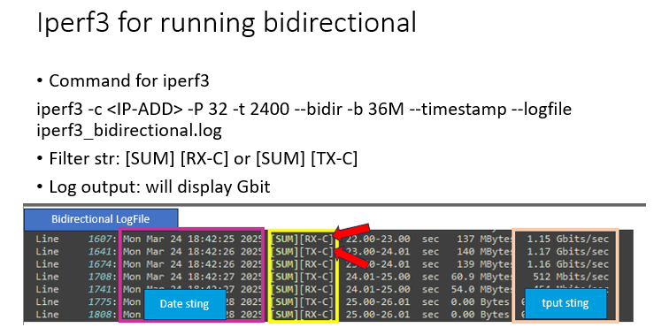
	
<a name="1.4"></a>
### All log comparison [🔙](#1.LogFileStructure)

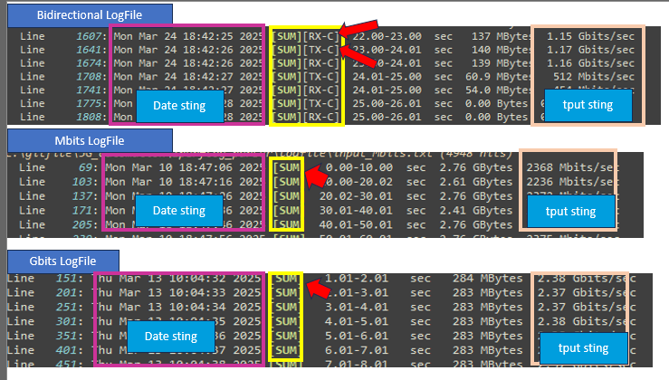

As you can above pciture, I will get the **Datetime**, **Throughput value** `2.37 Gbits/sec` or `2368 Mbits/sec` to capture the result and save into excel or txt file. 

<a name="2.pythonCode"></a>
## 2. Python File Overview [🔝](#Content)

| FileName | Mbit | Gbit |excel|txt|progress|Remark|
| :-- | :--: |:--:|:--:|:--:| :--:| :--|
|parse_mbit_to_gb_excel.py | V  | V | V | X |V|*major convert mb to gb|
|parse_mbit_excel_release.py| V  | V | V | X |V|*major display mb|
|bidirectional_excel.py| NA  | NA | V | X |V|*major for bidirectional log write result to excel|
|bidirectional_exel_graph.py| NA  | NA | V | X |V|*major for bidirectional log write result to excel and plot graph|
|parse_alllog_excelSheet.py| V  | V | V | X |V |*major for gbit|
|parser_result_txt.py| V  | V | X |V |X | minor|
|txt_excel_convert.py| V  | X| V  |V | X |minor|
|parse_GBytes_mbit_toexcel.py| V  | X| V | X|X |minor|
|extract_big_logFile.py| NA  |NA | X | V |V|Split large file|

- [2.1 parse_mbit_to_gb_excel: Parse both mbit and gbit and write result to excel ](#2.1) 
- [2.2 Parse_mbit_to_excel: Parse mbit logFile and write result to excel without convert value to gb](#2.2) 
- [2.3 Parse_bidirectional: Parse bidrectional log and write result to excel on different sheet](#2.3) 
- [2.4 Parse_log_workingdir: Parse All log file and write result to excel in different sheet](#2.4)
- [2.5 parse_result_txt: Parse and export result to txt file](#2.5) 
- [2.6 parse_GBytes_mbit_toexcel: Parse log contain Mbits and GBytes value and save to excel](#2.6) 
- [2.7 Split_LargeFile_smallFile: Split large logfile into smaller file](#2.7) 
- [2.8 debug using ](#2.8) 


<a name="2.1"></a>
### 2.1 parse_mbit_to_gb_excel: Parse both mbit and gbit and write result to excel [🔙](#2.pythonCode)
- Code Name: `parse_mbit_excel.py`
	- Description: This will parse mbit, and gbit log file, and get the Tput value with the unit. In this code I had made many adjust  which include adjusting the unit, conveting the tput value to consisteny value,adding progress bar and etc.
	- Support LogFile: `input_Mbits` `input_Gbits` 

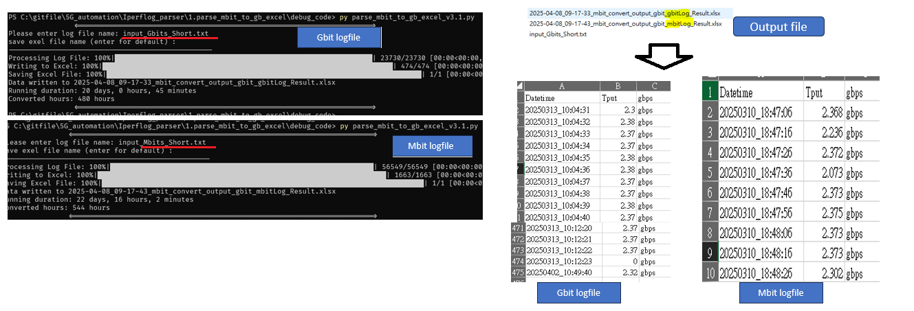

- Release each version in this code:
	- v3.1: resolve capture date with space with single date, and default output file. 
	- v2.3: wrap up each feature into individual function
	- v2.2: Resolve previous unit issue such as convert tput to consisteny value, adjust width column, and progress bar
	- v2.1: perserve logfile unit type
	- v2.0: change to write into excel file, and improve capture mbit and gbit unit type. 
	- v1.0: inital release parse logfile, cpature result and write into txt file
	
<a name="2.2"></a>	
### 2.2 Parse_mbit_to_excel: Parse mbit logFile and write result to excel without convert value to gb [🔙](#2.pythonCode)
This is similar to previous one, but this code only support Mbit, which will not convert mbit to gbit. It will remain mbps value, in case if you don't want to convert gbit, then you can use this code. 

- Code Name: `parse_mbit_excel_release.py`
	- **Description**: This is realated to above, but this only allow to parse Mbit logfile, and write the mbps into excel file without convert to gb. This is an alernative of above, in case you don't want to convert the Tput value into gb. It like mbit tput value will display 1000 mbit, and in above case will convert it to gb by divide by 1000. In this case it will perserve the tput mbps without convering. 
	- **Support LogFile**: `input_Mbits`
	
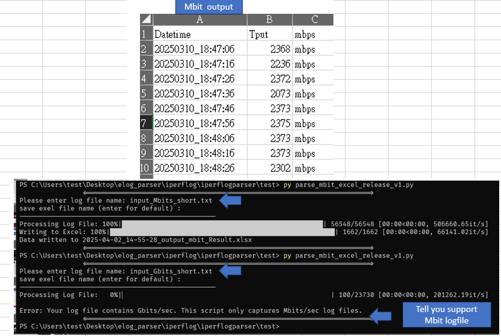


<a name="2.3"></a>
### 2.3 Parse_bidirectional: Parse bidrectional log and write result to excel on different sheet [🔙](#2.pythonCode)
- Code Name: `bidirectional_excel.py`
	- **Description**: This case allow to parsing the bidrirectional tput value into excel. If you see the bidirectional log you will have notice will have a TX and RX string which is what I will filter to capture the TPUT value. 
	- **Support LogFile**: `iperf3_bidirectional`

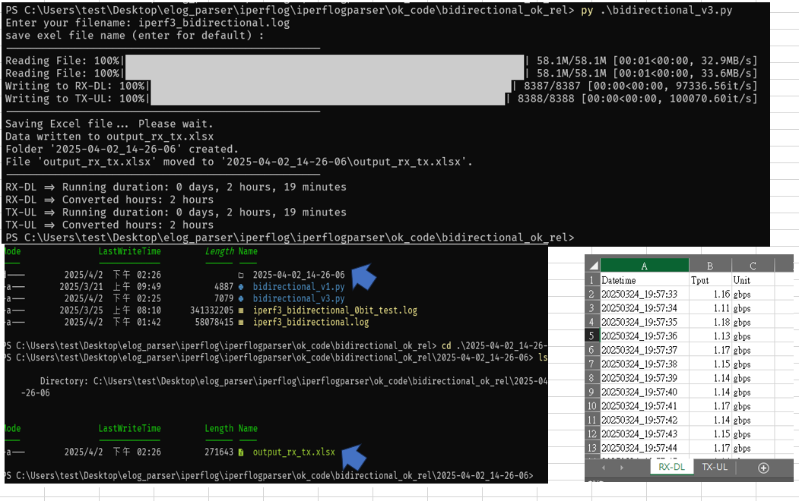

- Code Name: `bidirectional_exel_graph.py`
	- **Description**: This will [arse result just like above just will plot the data into graph 
	- **Support LogFile**: `iperf3_bidirectional`
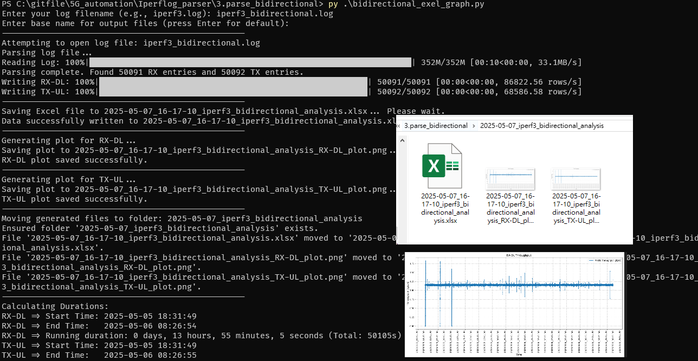

<a name="2.4"></a>
### 2.4 Parse_log_workingdir: Parse All log file and write result to excel in different sheet (sheet name by filename) [🔙](#2.pythonCode)
- Code Name: `parse_alllog_excelSheet_v2_release.py`
	- **Description**: This case will just parse all the log or txt file extesion file and parse these log without enter your log file and write result into excel. 
	- **Support LogFile**: `input_Mbits` `input_Gbits` 

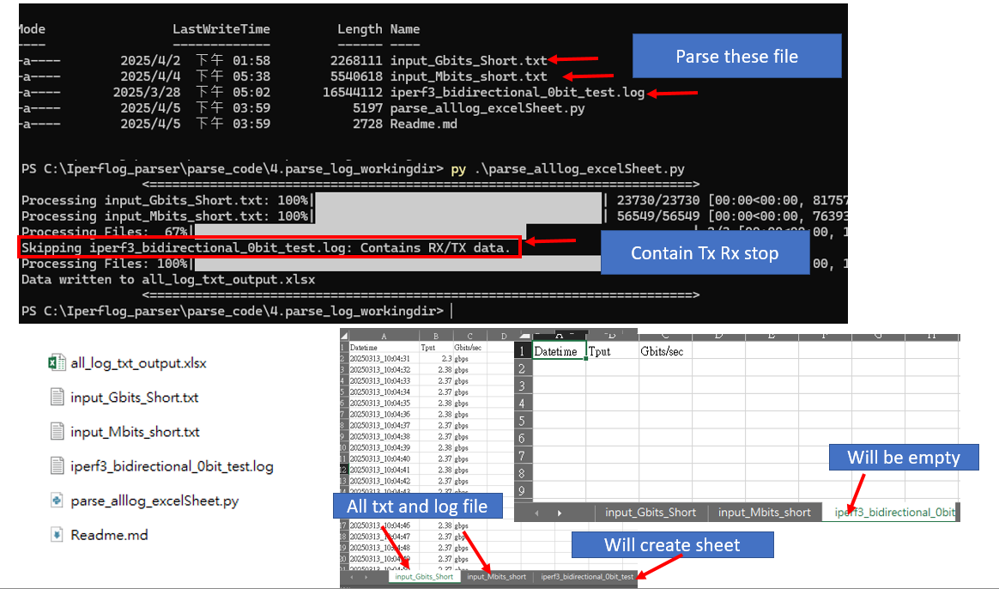

<a name="2.5"></a>
### 2.5 parse_result_txt: Parse and export result to txt file  [🔙](#2.pythonCode)

- Code Name: `parser_result_txt.py`
	- **Description**: parse and write result into txt file. This is also an alternative usage in case you want to know how to write into txt file 
	- **Support LogFile**: `input_Mbits` `input_Gbits`
   
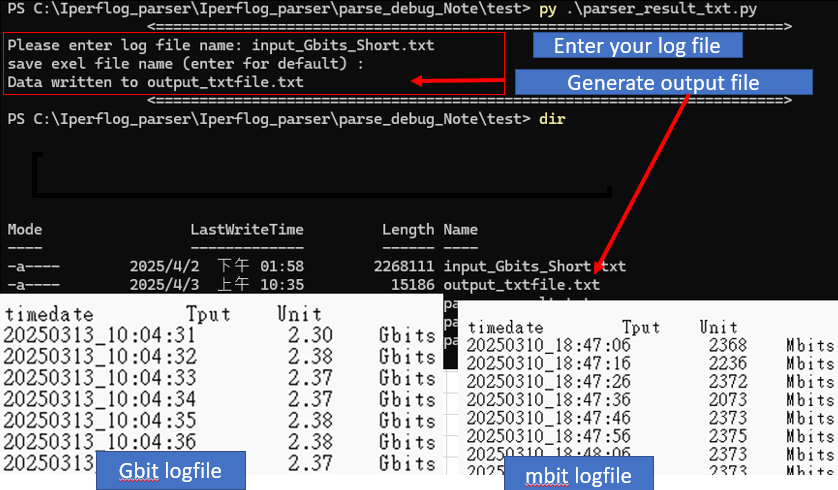

- Code Name: `parser_txt_excel_convert.py`
	- **Description**: Parse result and write into excel, txt or, both
	- **Support LogFile**: `input_Mbits`
 
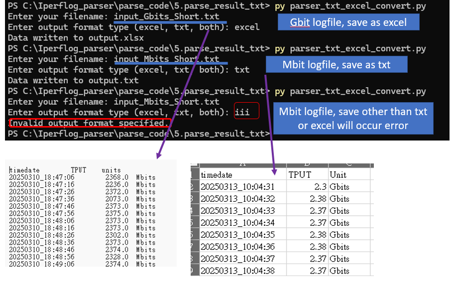

<a name="2.6"></a>
### 2.6 parse_GBytes_mbit_toexcel: Parse log contain Mbits and GBytes value and save to excel [🔙](#2.pythonCode)
- Code Name: `parse_GBytes_mbit_toexcel.py`
	- **Description**: Show how to parse only mbit and gbit for gbit log file, since it contain both mbit and gbit string.
	- **Support LogFile**: `input_Mbits` 
 
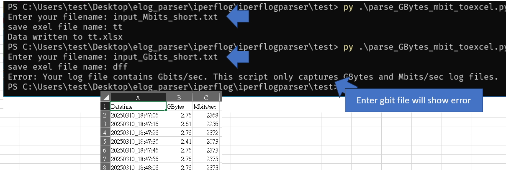

<a name="2.7"></a>
### 2.7 Split_LargeFile_smallFile: Split large logfile into smaller file (ex:1~2Gb logfile) [🔙](#2.pythonCode)
- Code Name: `extract_big_logFile.py`
	- **Description**: If you have a large logfile like 2Gb some editor not able to open. This script will split the code into multiple file, so you can use editor tool to open it. 

<a name="2.8"></a>
### 2.8 debug using  [🔙](#2.pythonCode)

- Code Name: `convertdateFormat.py`
	- **Description**: convert datetime to specfic format 
	- **File**: `datedata.txt`: code will read this file and write result into `output.txt` file.

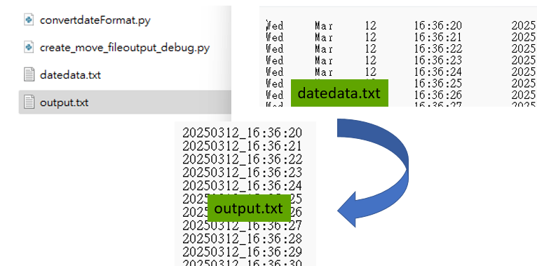

- Code Name: `reading_parseLogFile.py`
	- **Description**: parse capture result and print output
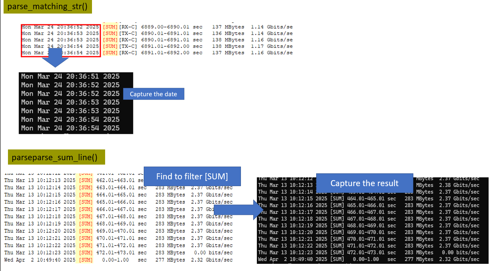
	
- Code Name: `timeduration_calc.py`
	- **Description**: calculate the start and end time to see the duration time


- Code Name: `create_move_fileoutput_debug.py`
	- **Description**: use for testing generate file, create folder and move file into folder.

<a name="3"></a>
## 3.Code Explantion on each feature [🔝](#Content)
- [3.1 parser regular expression](#3.1)
- [3.2 convert datetime](#3.2)
- [3.3 parse result and save to txt file](#3.3)
- [3.4 write result into excel](#3.4)
- [3.5 Dynamically set the header](#3.5)
- [3.6 Excel remove default sheet and create new sheet](#3.6)
- [3.7 Adjust the width of first column](#3.7)
- [3.8 Add progress bar](#3.8)
- [3.9 Error while reading](#3.8)

<a name="3.1"></a>
### 3.1 parser regular expression [🔙](#3)
- 1. parse only mbit and git  logfile content
Reg argument: `(M|G)bits/sec`:
```
re.match(r"(\w{3} \w{3} \d{2} \d{2}:\d{2}:\d{2} \d{4}) \[SUM\].*?([\d\.]+) (M|G)bits/sec", line)
```
- 2. parse only mbit gbit and bit logfile content
Reg argument: `(bits|Mbits|Gbits)`:
```
match = re.match(r"(\w{3} \w{3} \d{2} \d{2}:\d{2}:\d{2} \d{4}) \[SUM\].*?([\d\.]+) (bits|Mbits|Gbits)/sec",line)
```

- 3. parse space with single date

Reg argument: `\s+\d{1,2} `:
```
match = re.match(r"(\w{3} \w{3}\s+\d{1,2} \d{2}:\d{2}:\d{2} \d{4}) \[SUM\].*?([\d\.]+) (bits|Mbits|Gbits)/sec",line)
```
<a name="3.2"></a>
### 3.2 convert datetime  [🔙](#3)
```
#match
match = re.match(r"(\w{3} \w{3} \d{2} \d{2}:\d{2}:\d{2} \d{4}) \[SUM\].*?([\d\.]+) (M|G)bits/sec", line)
date_str = match.group(1)
date_obj = datetime.strptime(date_str, "%a %b %d %H:%M:%S %Y")
formatted_date = date_obj.strftime("%Y%m%d_%H:%M")
print(formatted_date)
```
<a name="3.3"></a>
### 3.3 parse result and save to txt file  [🔙](#3)
```
with open(input_file, 'r') as infile, open(output_file, 'w') as outfile:
	for line in infile:
        if "[SUM]" in line:
			....
			#match
			if match:
				..... 
				#convertdate
				outfile.write(f"{formatted_date} {transfer_str}\n") #write result into txt file
			else:
                print(f"Warning: Line with [SUM] did not match regex: '{line}'. Skipping.") 
```
<a name="3.4"></a>
### 3.4 write result into excel  [🔙](#3)
```
import openpyxl
with open(input_file, 'r') as infile:
	....
	if data:
		workbook = openpyxl.Workbook()
		sheet = workbook.active
		#sheet.append(["Datetime", "Tput", "GBytes"])  # Header row
		workbook.save(output_excel_file)
		print(f"Data written to {output_excel_file}")
```
<a name="3.5"></a>
### 3.5 Dynamically set the header  [🔙](#3)

```
import re
#regular expression matching:
match = re.match(r"(\w{3} \w{3} \d{2} \d{2}:\d{2}:\d{2} \d{4}) \[SUM\].*?([\d\.]+) (M|G)bits/sec", line)
....
current_unit = match.group(3)  # Get the unit (M or G)

workbook = openpyxl.Workbook()
sheet = workbook.active
# Set the unit if it's the first time we encounter it
if unit is None:
    unit = current_unit

# Dynamically set the header
if unit == "G":
    header = ["Datetime", "Tput", "gbps"]
else:
   header = ["Datetime", "Tput", "mbps"]

sheet.append(header) #

for row in data:
    sheet.append([row[0], row[1], header[2]])  # Write data rows with the correct unit
	 #fixe header
	 #sheet.append([row[0], row[1], "Gbits"])  # Write data rows
     #sheet.append([row[0], row[1], "Mbits"])  # Write data rows
```
<a name="3.6"></a>
### 3.6 Excel remove default sheet and create new sheet [🔙](#3)
```
workbook = openpyxl.Workbook()
rx_sheet = workbook.create_sheet("sheetName")
header = ["Datetime", "Tput", "Unit"]
sheet.append(header)
for row in data:
    sheet.append(row)

	
#if sheet exist delete sheet
if 'Sheet' in workbook.sheetnames:
    del workbook['Sheet']
```
<a name="3.7"></a>
### 3.7 Adjust the width of first column [🔙](#3)
Due to if you have realize the datetime some text will be hidden, need to manually adjust the width of the column. So this code will automatic adjust the width. 
```
# Adjust datetime column width
datetime_column = sheet['A']
max_length = 0
    for cell in datetime_column:
        try:
            if len(str(cell.value)) > max_length:
                max_length = len(str(cell.value))
            except TypeError:
                pass
        adjusted_width = max_length + 2
        sheet.column_dimensions['A'].width = adjusted_width
```

- Write file into excel and delete default worksheet 

```
#file: allFile_excelsheet.py
# Delete the default sheet if it exists
if "Sheet" in workbook.sheetnames:
	del workbook["Sheet"]
```
<a name="3.8"></a>
### 3.8 Add progress bar [🔙](#3)

- `lines = infile.readlines()`: #reads the entire file content into a list 
Note: This means the entire log file is loaded into memory at once. If your log file is very large, this could consume a significant amount of RAM.
- `with tqdm(total=len(lines), desc="Parsing Log Lines")`
	- `total=len(lines)`: tells tqdm that the progress bar should track progress over the number of lines in the lines list.
	- `desc="Parsing Log Lines"`: sets the description that will be displayed before the progress bar.
- `pbar_parse.update(1)`:
Inside the loop, `pbar_parse.update(1)` increments the progress bar by 1 for each line processed. This tells tqdm that one more iteration has been completed.

```
from tqdm import tqdm
#parsing logfile
with open(input_file, 'r',  encoding='utf-8', errors='replace') as infile:
	#reads the entire file content into a list called lines
    lines = infile.readlines()
    with tqdm(total=len(lines), desc="Parsing Log Lines") as pbar_parse:
        for line in lines:
			if "[SUM]" in line:
				.......
				#matching reg
			pbar_parse.update(1)
.........
if data:			
	#prpgress bar adding  excel 
	workbook = openpyxl.Workbook()
	sheet = workbook.active
	header = ["Datetime", "Tput", "gbps"]
	sheet.append(header)
	with tqdm(total=len(data), desc="Writing Data to Excel") as pbar_write:
		for row in data:
			sheet.append([row[0], row[1], header[2]])
			pbar_write.update(1)
............
```

Step of this code: 
1. First reads the entire log file into memory.
2. Then, it iterates through each line in memory.
3. tqdm creates a progress bar that reflects the progress of this iteration, with the progress bar moving forward for each line processed.
Therefore, the progress bar accurately represents the progress of parsing the log file, but it does so by counting the lines that have already been loaded into memory.


<a name="3.9"></a>
###  3.9 Error while reading [🔙](#3)
If you just use `with open(input_file, 'r'), if your contain other codec like chinese or other related language it might occur below Error:
> `Error: An unexpected error occurred: 'cp950' codec can't decode byte 0xe9 in position 11: illegal multibyte sequence`

To fix this solution, just add like below option will solve it. 
```
with open(input_file, 'r', encoding='utf-8', errors='replace') as infile:
	....
```
<a name="4"></a>
## 4. Summary [🔝](#Content)

This code allow you to analysic log file, read logfile, capture specific string, and write result into excel or txt file. I have convert some of the code into exe file. If you want to play around with it, you can run the exe file and see what's it like in case if you don't have python envirnoment. 

