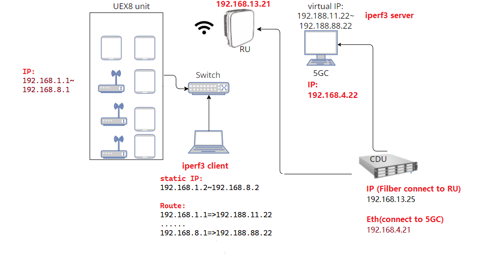

# Description on Automation Script 

## Envirnoment 

## CDU Related Script

`scp_downloadFile.sh`: download file from CDU server to local side
`scp_downloadFileLog.sh`: download CDU log(hot code) file from CDU server to local side
`scp_upload.sh`: upload file (Ex: firmware) to CDU Server

## FTP_HTTP_Test
This is an FTP and HTTP test, to be updated 

## IPERF Script

- Prerequisite:
please install `iperf3` package

### Description of the code
This is an automation of multiple `iperf3 server` that will automate opening many tab
if you run as sudo all the terminals will open a new terminal window
if run as normal user will open the terminal with new tab

> IPERF Command:
>> UDP UL: 'iperf3 -c <IP address> -i 1 -l 1300 -b <size> -t <time> -u'
>> 
>> UDP DL: 'iperf3 -c <IP address> -i 1 -l 1300 -b <size> -t <time> -u -R'
>> 
>> TCP UL: 'iperf3 -c <IP address> -i 1 -l 1300  -P 8 -t <time> '
>> 
>> TCP DL: 'iperf3 -c <IP address> -i 1 -l 1300  -P 12 -t <time> -R ' 

### How to run iperf3 server automation:
> './iperf_server_terminal_title.sh' for default port 
> './iperf_server_terminal_port.sh' for port 5202 
> './iperf_server_terminal.sh' for default port and default title

### Code Description
> Terminal with the Title name 
'gnome-terminal --tab  --title="Terminal Name" -- bash -c "iperf -s ; exec bash -i "' 

