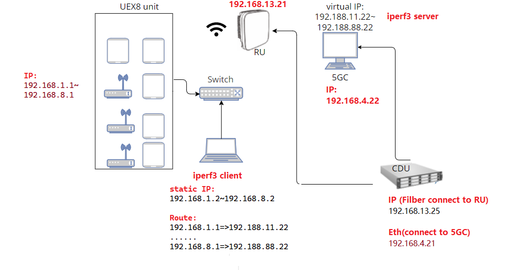

# Description on Automation Script 

## Topology Environment 

- `add_virtual_IP.sh`: add and delete virtual ip address
- `CDU_Fw_upgrade.sh`: upgrade firmware
- `SSH_multiply_Host.sh`: ssh multiple host 

### scp_transferfiles: download and upload file using scp
	- `scp_downloadFile.sh`: download file from CDU server to local side
	- `scp_downloadFileLog.sh`: download CDU log(hot code) file from CDU server to local side
	- `scp_upload.sh`: upload file (Ex: firmware) to CDU Server

### FTP_HTTP_Test
This is an FTP and HTTP test, to be updated 

### IPERF Script

- Prerequisite:
please install `iperf3` package

#### Description of the code
This is an automation of multiple `iperf3 server` that will automate opening many tab
if you run as sudo all the terminals will open a new terminal window
if run as normal user will open the terminal with new tab

> IPERF Command:
>> UDP UL: 'iperf3 -c <IP address> -i 1 -l 1300 -b <size> -t <time> -u'
>> 
>> UDP DL: 'iperf3 -c <IP address> -i 1 -l 1300 -b <size> -t <time> -u -R'
>> 
>> TCP UL: 'iperf3 -c <IP address> -i 1 -l 1300  -P 8 -t <time> '
>> 
>> TCP DL: 'iperf3 -c <IP address> -i 1 -l 1300  -P 12 -t <time> -R ' 

#### client: run iperf client
- `iperf_client_7UE_bidirectionNew.sh`: run 7 CPE on bidirectional 
- `iperf_client1UE_bidirection.sh`: run only 1 CPE
- `iperf_client7UE.sh`: run 7 CPE on unidirectional

#### server: run iperf server with terminal name 
- `./iperf_server_terminal_title.sh`: for default port 
- `./iperf_server_terminal_port.sh`:  run iperf withfor port 5202 
- `./iperf_server_terminal.sh':  for default port and default title

### telnet cpe 

How to run: `cpe.sh 1 ` in the script `spawn telnet 192.168.$1.1`, which `$1` means 192.168.X.1, the $1 mean the x IP. For example if your cpe gateway is 192.168.8.1, them put 8 instead of 1. 

- `cesqdbm.sh`: check the CPE RF singal 
- `cfun01.sh`: airplane on off

### Code Description
> Terminal with the Title name 
'gnome-terminal --tab  --title="Terminal Name" -- bash -c "iperf -s ; exec bash -i "' 

