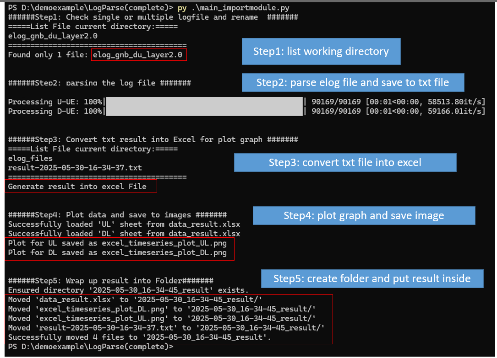
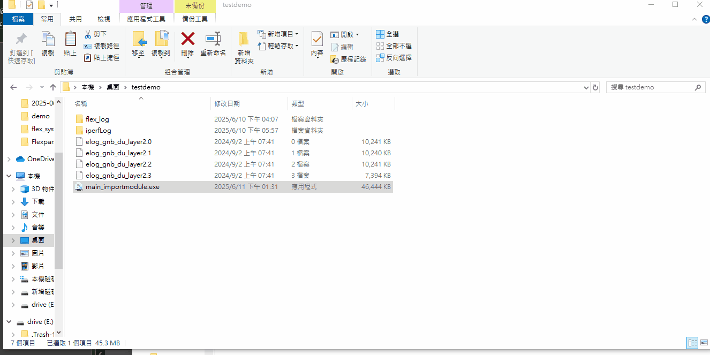
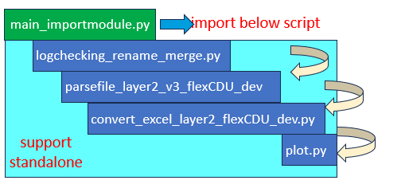

# Description of code

## LogParse(Complete)
This is a full code that will parse the logfile and extract the results, including a txt file, an excel file, and a png file. 

### How to run the code
You can run with two method: 
- Method1: Each script support stand alone, which allow you to execute iteself for debug usage. 
- Method2: Run `main_importmodule.py`, this code will import all the script together and run one time to do all step. 

**Output:**



Below is the step, I have build all script into exe file, but it's the same as above:



You can build all python file by this command: 
>  `pyinstaller --onefile --icon=parsing.ico .\main_importmodule.py`

### Step and code order



You can run individual code, or just run the `main_importmodule.py`, which will import all the code at once. 
- Step 1 : `main_flex_singleUE.py` and `logchecking_rename_merge.py`: 
Check working directory check `elog_gnb_du_layer2.*` contain single or multiple file.
If contain single elog file, rename log to `elog_files`, if contain multiple elog file then it will read all the elog and merge into elog file and name file as `elog_files`. 

Note: When you run overnight or many hrs, it will provide multiple elog file, instead one one file. 

Update: Rename `main_importmodule.py` script into `main_flex_singleUE.py`

- Step 2: `parsefile_layer2_v3_flexCDU_dev.py`: 
parse log file and filter both `UL` and `DL` string for the `tput`, `mcs` related value and save result into txt file

- Step 3: `convert_excel_layer2_flexCDU_dev.py`: 
It will read the text file which generate in step2 and convert the result into Excel. It will record the UL in to one sheet and DL into anthoer sheet. 

- Step 4: `plot.py`: plot the Excel file result into a line graph
- Step 5: `main_flex_singleUE.py`: 
Finish up the code will end up wrap up all the results into a new folder. This mean it will create folder, all your file text file, excel, and image will move into folder. 

## Code explanation

### Standalone code
As you can see all the script except the main_importmodule.py it will have ` __name__ == "__main__`. This means if you run this code below code will be execute. But if you run the `main_importmodule.py` it will not be excecute. 
```
# Ensure standalone functionality
if __name__ == "__main__":
    ....standalone code.....
```

If you run the `main_importmodule.py` i will import each file like below:
```
import logchecking_rename_merge
import parsefile_layer2_v3_flexCDU_dev
import convert_excel_layer2_flexCDU_dev
import plot
```

After import these script, I will call each function of the file like :
```
logchecking_rename_merge.check_file_count_glob(file_pattern)
```

### Read the elog file and filter the tput value

- Filter UL TPUT data
```
import re 
with open('elog_gnb_du_layer2.0', 'r') as filedata:
    for line in filedata:   
        if 'U-UE' in line:
            search = re.search(r'\[(\d+\.\d+\.\d+)\].*?(Tput=[^A]+)', line)
            print(search.group(2))   
```
- User enters filter type UL DL or both
Select the traffic string you want to parse, UL DL, or both traffic. 
```
accepted_strings = re.compile(r"^(D-UE|U-UE)(\[\d\]|\[ \d\])?$|^both$")
givenString = input("Please enter your search (Ex: D-UE / U-UE/ U-UE[ 0] / both:):")
if accepted_strings.match(givenString):
        if givenString =="both":
            UL = 'U-UE'
            DL = 'D-UE'
            writefile("UL")
            ULDLprint(UL)
            writefile("DL")
            ULDLprint(DL)
        else:        
            writefile(givenString)
            with open(elogfileName, 'r') as filedata:
                for line in filedata:   
                    if givenString in line:
					# Print the line, if the given string is found in the current line
                    #print(line.strip())
                        parse(line, givenString)
else:
    print("Not found, please reenter correct option") 		
```

### analysic the related string 

- Parse the data:
```
datestr = data.split('[', 1)[1].split(']')[0]  
search = re.search(r'\[(\d+\.\d+\.\d+)\].*?(Tput=[^A]+)', data)
m3New = re.sub(r"[\(\[].*?[\)\]]", "", search.group(2)).replace('=', '= ').replace(',', ' ').strip().split()
result.clear()
```
- save the value in a list 
```
givenString=ULDLstr
bler="Bler="
result.append(datestr)    
result.append(getelement(m3New, 'Tput='))
result.append(getelement(m3New, 'RB='))
result.append(getelement(m3New, 'Mcs='))
result.append(getelement(m3New, bler))
listprint() 
```

- write into a file
```
def listprint():
    #checkfile()
    cycle = 0        
    with open(filename, "a") as f:
        for element in result:            
            f.write(element+ " ")     
        f.write("\n")
```


