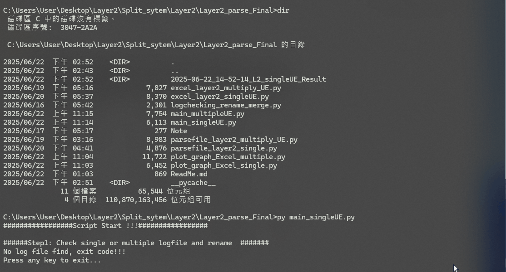
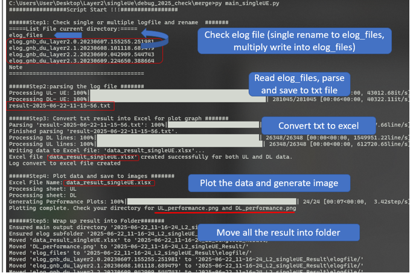
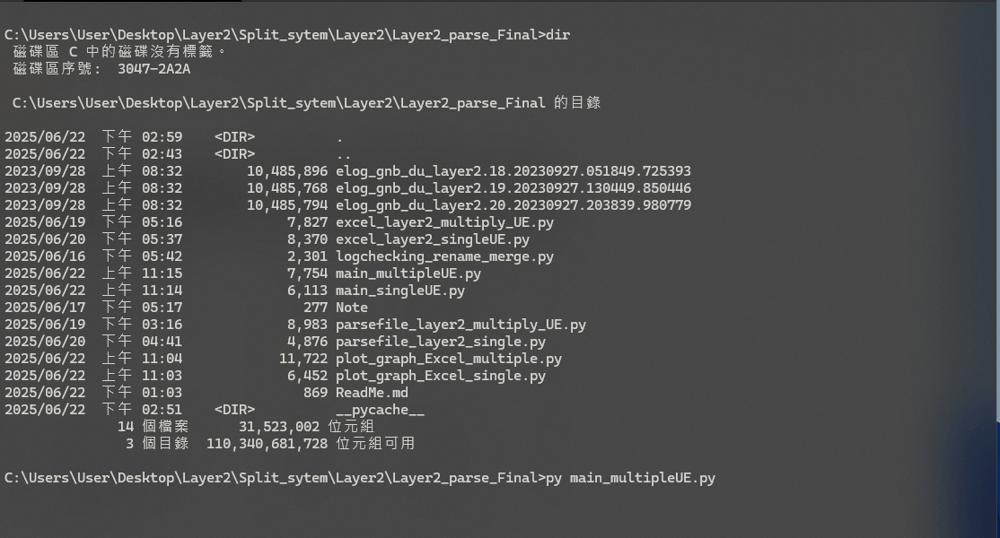
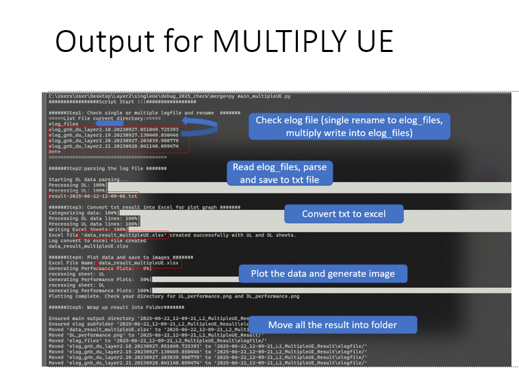
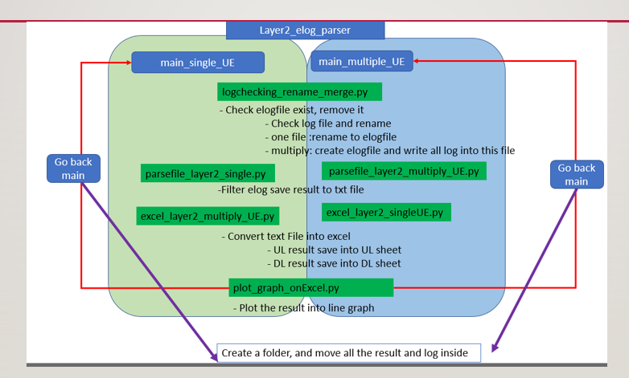

# Split CDU System Log parser autoscript

## Description:
This script will run SingleUE and Multiple all in once. However you can run each file for standalone. Each code I had implement `__name__ == "__main__"` so you can run alone will not effect. 

## Step running 

- Step1: Check current directory elog_gnb_du_layer2.* File and rename
	- delete elogfiles if exist (might be previous result)
	- elog file Exist 1 file: rename file to elogfiles
	- elog file exist >2 file: write all file into one file and name elogfiles
- Step2: Start to read elogfile
	- read the elog file
	- Filter string
	- Save result into result-<Datetime>.txt file 
- Step3:convert the txt file into excel 
- Step4: plot the excel file data 
	- Create two sheet in excel, UL and DL
	- Convert UL into UL sheet, and DL into DL sheet
- Step5:create a folder and move all result file into the folder

## How to run

- Single UE: when you only have one UE result in elog file


**output:**


- Multiple UE: when you have multiple UE result logged in elog file


**output:**


## Structure and Process 


## Code Explanation

- Plot graph: `plt.figure(figsize=(20, 8), dpi=300)` 
```

20 means the figure will be 20 inches wide.
8 means the figure will be 8 inches tall.

Width in pixels = figsize_width * dpi = 20 inches * 300 dpi = 6000 pixels
Height in pixels = figsize_height * dpi = 8 inches * 300 dpi = 2400 pixels
```


