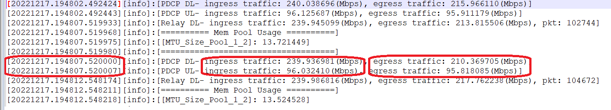
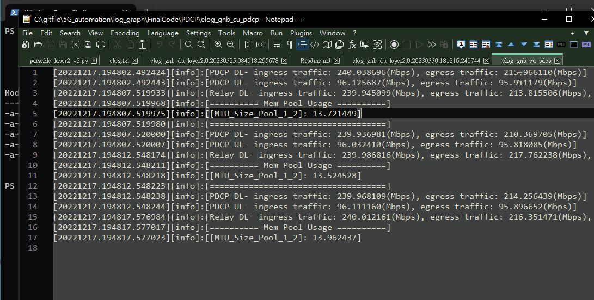
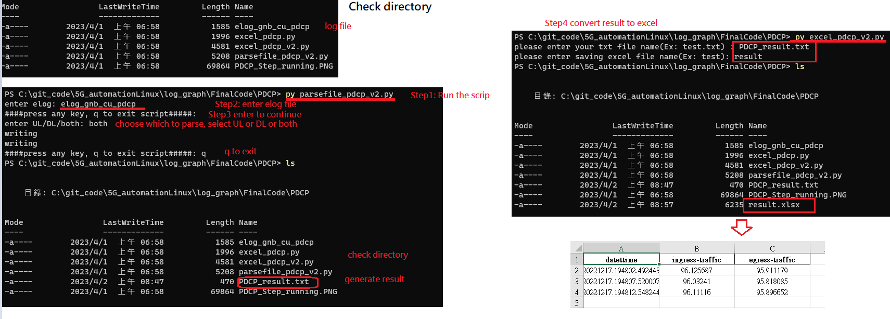

# Parse PDCP Log File

This automation script is used to parse pdcp log file. Let me explain the log file:
- `parsefile_pdcp_v2.py`: parse the elogfile and write the result into a txt file
- `excel_pdcp_v2.py`: convert the text file to Excel file 

I will parse `DL` and `UL` realted string, but there is one special string that is differnt for UL and DL that is Bler:
    - `UL`: PuschBler nonWDuschBler
    - `DL`: PdschBler nonWPdschBler
	


## How to Run

- **Step:**
	- Step 1: Enter your elog file name
	- Step 2: Start to parse the elog 
	- Step 3: Enter UL, DL, or both UL and DL for the string to filter and save the result into a text file
	- Step 4: Convert the text file into an Excel file

- How to run the PDCP parsing



- Parse result output:
```
=========================UL=========================
datettime ingress-traffic egress-traffic 
20221217.194802.492443 96.125687 95.911179 
20221217.194807.520007 96.032410 95.818085 
20221217.194812.548244 96.111160 95.896652 
=========================DL=========================
datettime ingress-traffic egress-traffic 
20221217.194802.492424 240.038696 215.966110 
20221217.194807.520000 239.936981 210.369705 
20221217.194812.548238 239.968109 214.256439 
```
- output:


## Code Description summary

### parsing result for tput and other related values

```
#checking for UL or DL
def ULDLprint(target):
    with open(elogfile, 'r') as filedata:
        for line in filedata:   
            if target in line:
                # Print the line, if the given string is found in the current line
                timeparse(line)
#write into txt file				
def emptywrite(status):
    with open(filename, "a") as f:
        f.write(f"="*25+status+"="*25+"\n")
        print("writing")
        f.write(("datettime ingress-traffic egress-traffic \n"))

#grab the next element 
def getelement(li, element):
    ind = li.index(element)
    return li[ind+1]
	
# Analyze the logfile with a regular expression find pattern    
def timeparse(data):
    datestr = data.split('[', 1)[1].split(']')[0]
    traffic: ([\d\.]+).+.', data)
    searchtest=re.search(r'(ingress [^(]+).+(egress [^(]+)',data)
    m3New= searchtest.group(1)+", "+ searchtest.group(2) 
    m3New_1=m3New.replace(", ", ":").strip().split(':')
    result.clear()
    result.append(datestr)  
    result.append(getelement(m3New_1, 'ingress traffic').strip())    
    result.append(getelement(m3New_1, 'egress traffic').strip())
    listprint() #write file =>ok

		
accepted_strings = {'UL', 'DL', 'both'}
givenString=input("enter UL/DL/both: ")
if givenString =="both":
	UL = 'PDCP UL'
    DL = 'PDCP DL'
    emptywrite("UL")
    #print(f"="*25+"UL"+"="*25)
    ULDLprint(UL)
    #split line ==
    emptywrite("DL")
    #print(f"="*25+"DL"+"="*25)
    ULDLprint(DL)
```

### Convert a text file into an Excel file
- Read log file
```
lists = {}
current_key = None
#with open ('test.txt', 'r')as myfile:  
with open (resultfilename, 'r')as myfile:  
    readline=myfile.read().splitlines()
    for line in readline:
        #print(line)
        if "=" in line:
            current_key = line.strip("=")           
            lists[current_key] = []
        else:
            assert current_key is not None # there shouldn't be data before a header
            lists[current_key].append(line)
...
if "DL" in lists and "UL" in lists:
    #print("both UL and DL exist")
    types="both"
    DL()
    UL()
    writeExcel(types)
elif "UL" in lists:
	....
elif "DL" in lists:
	....
```
- save to list
```
ULlist= []
DLlist= []
def UL():
    for i in lists["UL"]:
    #remove end space
        i=i.rstrip().split(' ')
        ULlist.append(i)
def DL():
    for i in lists["DL"]:
        i=i.rstrip().split(' ')
        DLlist.append(i)
```

- write into Excel
```
def writeExcel(result):
#writing into Excel sheet
    if result =="UL":
        #uplink
        df1 = pd.DataFrame(ULlist)
        df1 = df1.rename(columns=df1.iloc[0]).drop(df1.index[0])
        df1['ingress-traffic'] = df1['ingress-traffic'].astype(float)
        df1['egress-traffic'] = df1['egress-traffic'].astype(float)

```