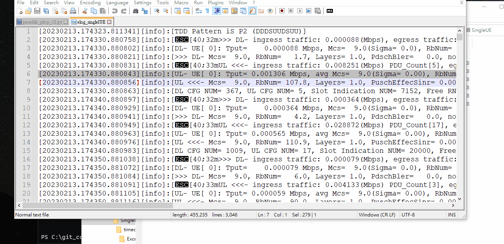
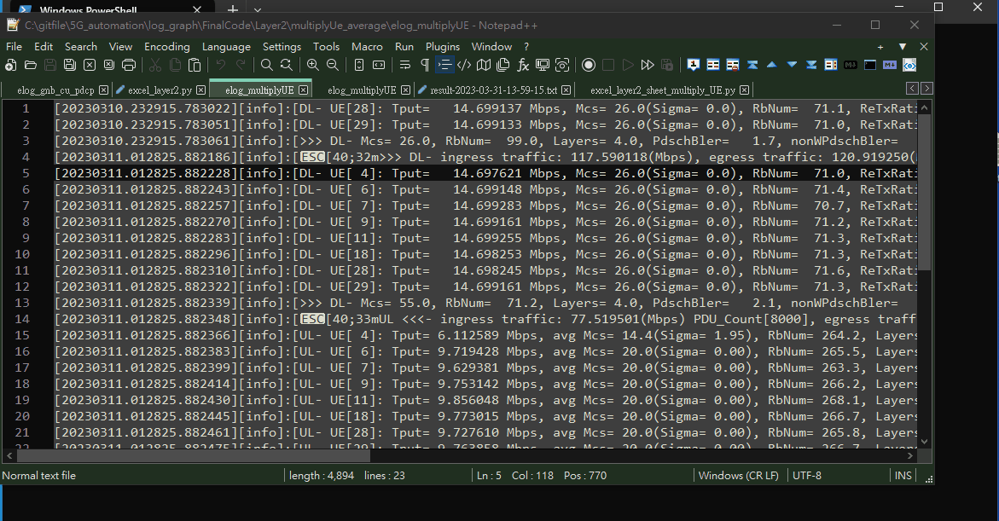
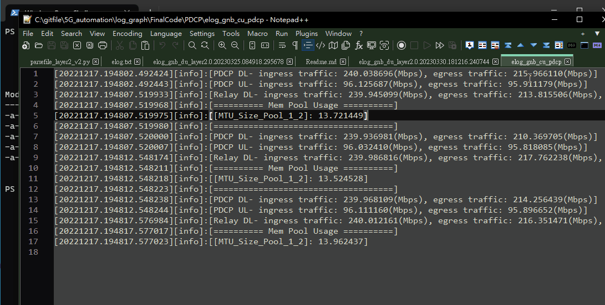

# How to run
## Layer2- single UE
- Path: `/FinalCode/Layer2/SingleUE/`
 

## Layer2- Multiply UE
- Path: `/FinalCode/Layer2/multiplyUe_average`
 

## PDCP UE
- Path: `/FinalCode/Layer2/SingleUE/timedate_tputONLY`

