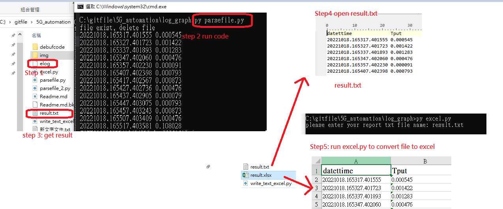
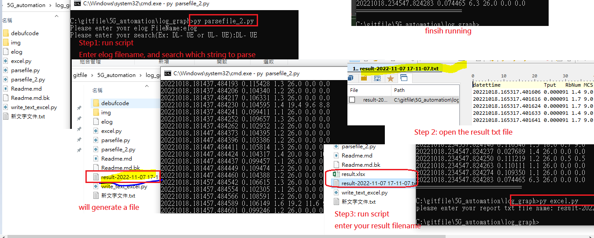
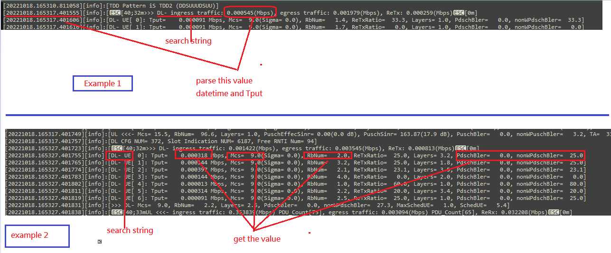

## Intro
I am going to develop a automation script to analysic the log file, and then transfer to graph. 

There will be two script because two different type of parsing keyword:
- datetime and Tput value
```
[20221102.064905.609030][info]:[>>> DL- ingress traffic: 555.198792(Mbps), egress traffic: 551.669556(Mbps), ReTx: 0.000000(Mbps)]
```
- datetime, tput, other value such as Mcs, RbNum, and etc
```
[20221102.064905.609113][info]:[DL- UE[ 0]: Tput=  555.198792 Mbps, Mcs= 26.0(Sigma= 0.0), RbNum= 198.4, ReTxRatio=   0.0, Layers= 4.0, PdschBler=   0.0, nonWPdschBler=   0.0]
```
## checklist status 
- [x] init
- [x] anlaysic data get datetime and tput value
- [x] anlaysic data more value
- [ ] draw graph 

## Update
- 202210: update example 1 and example intial code
- 20221117 update example2 script 
	- add write to text better format
	- write text to excel file
	- let user enter their elog filename and save result name
- 20221118: update parsefile2.py UL and DL search string different, fix this problem
	- check string is UL or DL and assign bler1 and bler2 with correct string
- 20221119: add parsefile_pdcp.py 
- 20221122: update parsefile2.py, add excel_pandas.py
	- parsefile2.py : givenstring change more condition
	-  excel_pandas: adding convert text to excel using pandas
	- parsefile_pdcp.py: update let user enter logfile and givenstring 
- 20221123: update parsefile2.py add elog parse log file before parse string
- 20221209: create parsefile2_v2_improve.py: improvement of the code. Use UL, DL or both to parse.  
- 20221221: 
	- change create parsefile2_v2_improve.py into parsefile_layer2_v2_.py
	- create parsefile_pdcp_v2.py improvement of the code. Use UL, DL or both to parse. 
	- add while loop into both parsefile_pdcp_v2.py and  parsefile_layer2_v2_.py for user to enter
	- add backup directory to keep old version code
- 20221226:
	-  rename parsefile2_v2_ to parsefile2_v2 and add better condition statement if enter wrong option will print error
	-  parsefile2.py add better condition statement if enter wrong option will print error 
	
## Step Manual Test 
1. Please put your log file in this file
2. run the code
	- run layer 2 only parse tput ingress: py parsefile.py 
	output: will be like this: datetime tput => 20221018.234547.824204 0.656478
	- run the code for layer2 more detail informtion : py parsefile2.py 
	- run the code for pdcp  for both ingress and engress tput : py parsefile_pdcp_v2.py 


## How to run 
- print result list after parsing :
You can decide write or print as below function:
    > listprint() #write file =>ok
    > listprint2() #print =>ok
    > listprint_Method2()  # write file =>ok
    > listprint_Method3() #write file =>ok
    > listprint_Method4()

### Example 1:

will elog and result is hotcode, if you wants yo chnaged please modidy it. 
Step1: ./parsefile.py
Step2: ./excel.py to convert from result.txt to excel 
givenString = "DL- ingress traffic"
Note: 
- Change your elog: 'with open('elog', 'r') as filedata:' change the elog to your elog filename
- change string to find : 'givenString = "DL- ingress traffic"'
- don't want to print please comment this part: 'listprint2()'



### Example 2: 
yiu have to enter your elog name, and search keyword. In this sample will parse many more detail value
Step1: ./parsefile_2.py
enter elog file name:
enter search keyword: uplink or downlink

Step2: ./excel.py 


## Code description:
I am going to show you many different way to parse the related value, you can use `regular expression`, or `split method`. 
There are two example in this code



### Step: 
1. The code will fist search on the keyword
2. If keyword match it will start to spit the datetime, and TPUT value. 
3. It will save to list and print it. (You don't have to save in list)

### main code
- file or log file: 
>　declare empty list and keyword you wants to filter or search
```
givenString = "DL- ingress traffic" #search word in a file
result = [] #empty list to store result
```
- read log file
```
with open('elog', 'r') as filedata:
    for line in filedata:   
        if givenString in line:
            # Print the line, if the given string is found in the current line
            #print(line)
            timeparse(line)
```
### Example1 read elog and parse time and tput value
file: `parsefile.py`
#### 1. parse keyword dateitme and tput value
##### method 1: using spit to spit timedate and tput value
Ｉwants to get the date and TPUT value, so I will use `spit` and `strip` method.
- `spit`: Spit what I wants
- `strip`: after spit, remove the empty space if there are

```
datestr = data.split('[', 1)[1].split(']')[0]
Tput = data.split(" DL- ingress traffic:", 1)[1].split(',')[0].split('(')[0].strip()
```
> Note: There are two option you can print or save to list and print list 
```
#save data to list (result)
result.append(datestr)
result.append(Tput)
# print 
print(datestr, Tput) 
```
##### method 2: regular expression get the date data only
using regular expression to parse the keyword, so `import re`
```
import re
s = "list[20221013.162853.788442]"
m = re.search(r"\[([0-9.]+)\]", s)
print(m.group(1) ) #20221013.162853.788442
```
### 2. print and write the result into a file
 There are many different method you can accomplish it, i will show you print and write into a file method. 
 > basic way to write or print
 > use `list Comprehensions` with `*unpack` list 
 > enumerate
  > zip method
 
#### Method 1 print two column datetime and tput result from list
- Print two column, the datetime and Tput value. 
- I have store all my datetime, and Tput into list, so if I just use print list, it will have all bunch of data, so I wish to have newline after date and tput, or two colummn. 
```
	cycle = 0
    for element in result:
        cycle += 1
        #print(element, end="")
        print(element, end=" ")
        if cycle % 2 == 0:
            print("")
```
#### Method 2 write into file basic way
```
    #checkfile()
    cycle = 0    
    #    with open("result.txt", "a+") as f:
    with open(filename, "a") as f:
        cycle += 1
        for element in result:            
            #print(element+ " ")
            f.write(element+ " ")           
        f.write("\n")
        #f.write()
```

#### Method 3 using List Comprehensions Or For loop  to print
```
for i in [result[c:c+2] for c in range(0,len(result)) if c%2 == 0]:
    print(*i) 
```
If you're not familar with it, you can use a normal `for loop` as below:
```
temp = []
for c in range(0, len(result)):
    if c % 2 == 0:
        temp.append(result[c:c+2])
for i in temp:
    print(*i)
```

#### Method 4 using enumerate to write and print
```
#results = ['A', 'B', 'C', 'D']
with open('result.txt', 'a') as output:
    for index, c in enumerate(result):
        if index % 2 == 0:
            #print(*results[index:index + 2])
            print(*result[index:index + 2], file=output)
```
#### Method 5 using Zip to write and print
```
#results = iter(["A", "B", "C", "D"])
results = iter(result)
with open('result.txt', 'a') as output:
    for i in zip(results, results):
        #print(*i)
        print(*i, file=output)
```

