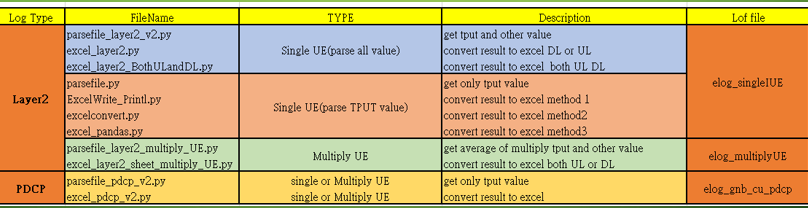
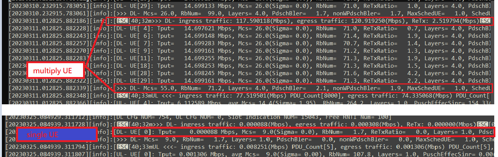
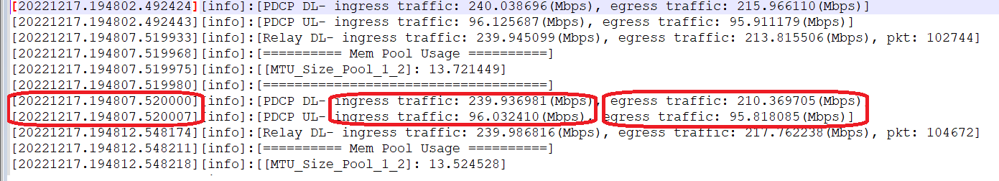
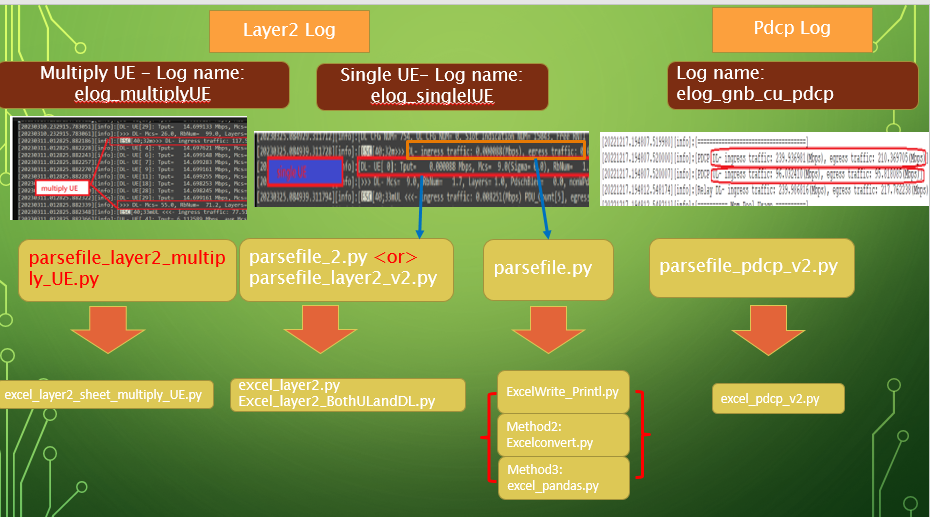
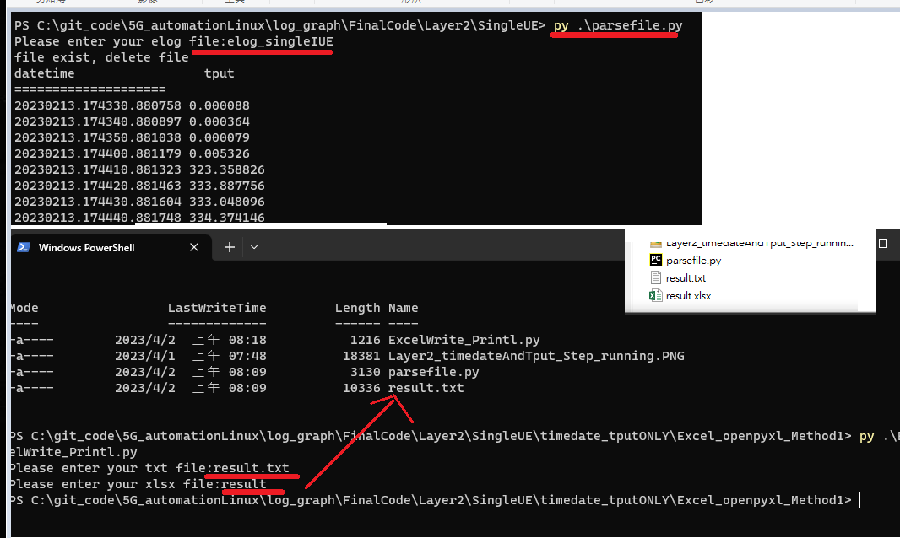
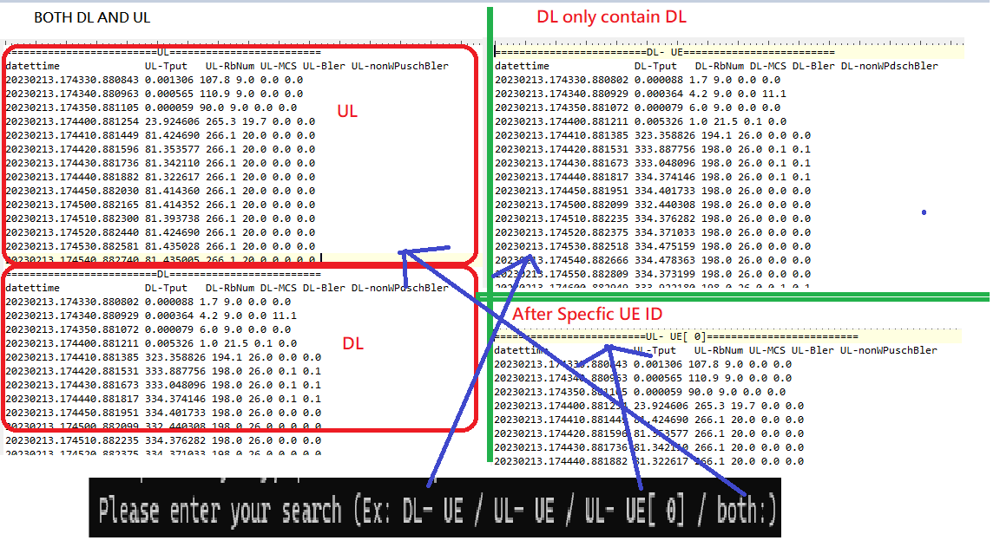
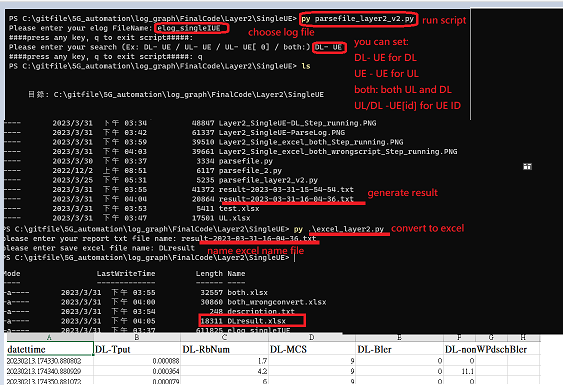
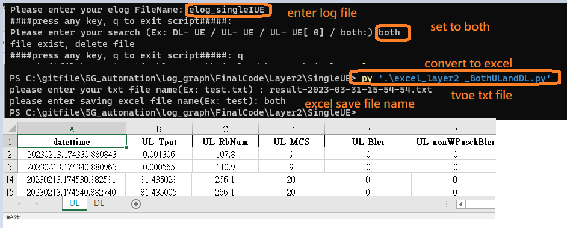
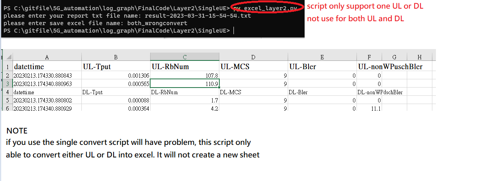
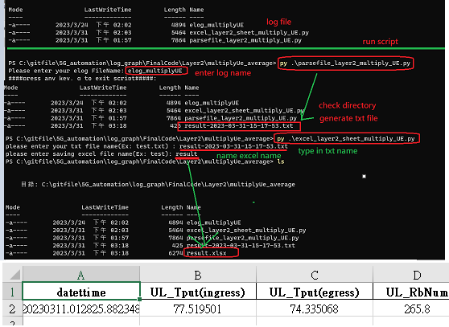

## Intro

I am going to develop a automation script to parse the file. After parsing will generate a txt file, and use the excel script to convert txt into excel file. 

There will be two different type of Tput value:

- datetime and Tput value
```
[20221102.064905.609030][info]:[>>> DL- ingress traffic: 555.198792(Mbps), egress traffic: 551.669556(Mbps), ReTx: 0.000000(Mbps)]
```

- datetime, tput, other value such as Mcs, RbNum, and etc
```
[20221102.064905.609113][info]:[DL- UE[ 0]: Tput=  555.198792 Mbps, Mcs= 26.0(Sigma= 0.0), RbNum= 198.4, ReTxRatio=   0.0, Layers= 4.0, PdschBler=   0.0, nonWPdschBler=   0.0]
```

## checklist status

- [x] init
- [x] anlaysic data get datetime and tput value
- [x] anlaysic data more value
- [ ] draw graph 

## Description of code

This is an automation of parsing the log file to get `UL/DL`(UL for Upload, DL for Download) related parameter or string. 
There're two types of code one is `Layer2 log` and `PDCP` log.  Below I will show you the log file information. 

- Layer2 Parameter: 
  - Single UE or Specfic ID: 
    - `UL or DL`: datetime, Tput
    - `UL`: datetime, Tput, MCS,PuschBler,nonWPuschBler
    - `DL`: datetime, Tput, MCS,PdschBler,nonWPdschBler
  - Multiply UE: datetime, ingress Tput, egress Tput, MCS, PuschBler,nonWPuschBler
    - `UL`: datetime, ingress Tput, egress Tput, MCS,PuschBler,nonWPuschBler
    - `DL`: datetime, ingress Tput, egress Tput, MCS,PdschBler,nonWPdschBler
- PDCP Parameter: 
  - datetime,ingress traffic, and egress traffic
- elog merge(2022-04 update new feature): 
	- This code is useful when you have multiply elog, it allow to merge into one file, and run above code to parse.
	- Filename: `merge_multiply_elogfile.py`
	> Method1:using `read and write`
	```
	#path
	directory = "."
    # Output file name
    output_file = "merged.txt"
	with open(output_file, "w") as outfile:
        for filename in os.listdir(directory):
            if filename.startswith("elog_gnb_du_layer2"):
                with open(os.path.join(directory, filename), "r") as infile:
                    outfile.write(infile.read())
	```
	> Method2: using `glob` libary
	```
	file_pattern = 'elog_gnb_du_layer2*'
    file_list = glob.glob(file_pattern)
	with open('merged_file.txt', 'w') as outfile:
        for file in file_list:
            with open(file, 'r') as infile:
                outfile.write(infile.read())
	```
### Step of this automation and file Name:


- Step 1 Put Your log into directory
  - I have place the related log into LogFile 
  `Note:` If you have multiply elog file, you can use this code to merge into onefile
- Step 2 run the script to parse the log's related parameter String like this: 
  - Single UE time and tput: 
    > `20221018.234547.824204 0.656478` 
  - Single UE timedate Tput MCS Bler and etc: 
    > `datettime UL-Tput UL-RbNum UL-MCS UL-Bler UL-nonWPuschBler`
    `datettime DL-Tput DL-RbNum DL-MCS DL-Bler UL-nonWPdschBler`
    `20230213.174330.880843 0.001306 107.8 9.0 0.0 0.0 `

  - Multiply UE timedate Tput MCS Bler and etc: 
    > `datettime DL_Tput(ingress) DL_Tput(egress) DL_RbNum DL_MCS DL_Bler DL_nonWdBler`
    `datettime UL_Tput(ingress) UL_Tput(egress) UL_RbNum UL_MCS UL_Bler UL_nonWuBler`
    `20230311.012825.882186 117.590118 120.919250 71.2 55.0 2.1 1.9`
- Step 3 run script to convert Step2 txt file into excel 


### Log File Description:
Let me show different Log type in this project. 
#### Log: Layer2
- L2log will display different with `single UE` and `Multiply UE`, UE please refer it as a Router. 
- Let me show below picture for more clear example of the log:



#### Log: PDCP

PDCP log will record both DL and UL traffic. ASk you can see below there are ingress and egress paramter string, I will parse the Tput of both string. 


## How to run code
- Something to Know how this script:
  - I will parse `DL` and `UL` realted string, but there is one special string that is differnt for UL and DL that is Bler:
    - `UL`: PuschBler nonWDuschBler
    - `DL`: PdschBler nonWPdschBler



### Example 1: Layer 2 Single UE get only Tput Value (ONLY DL)

In this example I `hotcode` the parsing parmater `ONLY DL`, you can change it. I will descript the code in below.
You can use Example2 as below, which is much flexible get `DL`, `Ul` or `both Ul and DL`. 

- Path: `/FinalCode/Layer2/SingleUE/timedate_tputONLY`

#### FileDescription:
  - `parsefile.py`: parse the log into txt file
  - `ExcelWrite_Printl.py`: convert the txt file into excel method1

I also have write other method of converting the excel:
  - `Excel_openpyxl_Method2/excelconvert.py`: convert the txt file into excel method2 
  - `ExcelPandasMethod/excel_pandas.py`: convert the txt file into excel using pandas method

##### How to run it
- Step1: parse the log => `./parsefile.py`
- Step2: convert generate txt file to excel => `./ExcelWrite_Printl.py`
 

#### Code Description and Note
- Hotcode only DL to search specfic string: givenString = "DL- ingress traffic"
- Parse string tput and Tput value 
  ```
    datestr = data.split('[', 1)[1].split(']')[0]
    Tput = data.split(" DL- ingress traffic:", 1)[1].split(',')[0].split('(')[0].strip()
  ```
- save result into list  
  ```
    result.clear() #clear all list element
    result.append(datestr) #save datetime to list   
    result.append(Tput) #save tput into list
  ```

- print result list after parsing :
  There are many different method to write txt file as below:
  > listprint() #write file =>ok
  > listprint2() #print =>ok
  > listprint_Method2()  # write file =>ok
  > listprint_Method3()  # write file =>ok
  > listprint_Method4()

### Example 2: Layer 2 Single UE get related string
In this example I will get this paramter string: `datettime Tput RbNum UL-MCS UL-Bler UL-nonWPuschBler`
- Path: `/FinalCode/Layer2/SingleUE/`
  
#### FileDescription:
- `excel_layer2_BothULandDL.py`: convert the txt file into excel both UL and DL
- `excel_layer2.py`:convert the txt file into excel UL or DL 
- `parsefile_layer2_v2.py`:parse the log into txt file
- `parsefile_2.py`:parse the log into txt file (old version, for debug use)

##### How to run it
Note: In this example there are serveral option you need to know: 
You can select `DL`, `UL`, `DL's ID` , `UL's ID` or `both` UL and DL`. Please refer below log:


My code will ask you to select these option:
  - `DL -UE`:parse only Downlink String
  - `UL -UE`: parse only Uplink String
  - `both`: parse only both UL and Downlink String
  - `DL -UE[ id]`: parse specfic UE's ID String      

> `Case1`: Get either `DL` or `UL` or `specfic DL/Ul ID`

Step1: parse the log => `parsefile_layer2_v2.py`
Step2: convert generate txt file to excel => `./ExcelWrite_Printl.py`
     

> Case2: Get both DL and UL string

- Step1: same as above Step1  =>`parsefile_layer2_v2.py` 
- Step2: convert generate txt file to excel => `./excel_layer2_BothULandDL.py`

> 

- If you use `Case1` result and convert using `Case2's` excel convert script `excel_layer2_BothULandDL.py` will have problem. 

- Please refer below picture, as you can see if you convert excel DL need to scroll down to fidn it and will not be bold.
> 

#### Code Description and Note
- will work with  specific UE ID like `[ 0]` or `[10]`
  `re.compile(r"([DU]L\-\ UE(\[\s*(\d{1,2})\])?)|both$")`
- below code will not work:  
  ```
  accepted_strings = re.compile(r"([DU]L\-\ UE(\[\ (\d)\])?)|both$") #only work with space [ 0] or  [ 1]
  accepted_strings = re.compile(r"([DU]L\-\ UE(\[\ {0,1}(\d)\])?)|both$") #will work with [ 01] but [11] not work
  ```

- excel method 1:
  ```
      while line:
          list123 = line.split()  # convert        
          if "=" in line:
              pass            
              #list123 = line.split(sep=' ')  # convert,
          else:
          #print(line)
          #if not "=" in line:           
              if list123[1] == 'Tput':
                  sheet[0].append(list123)  # write into excel
              elif list123[1] == 'DL-Tput':
                  sheet[0].append(list123)  # write into excel
              elif list123[1] == 'UL-Tput':
                  sheet[0].append(list123)  # write into excel                                       
              else:
                  list123[1] = float(list123[1])
                  list123[2] = float(list123[2])
                  list123[3] = float(list123[3])
                  list123[4] = float(list123[4])
                  list123[5] = float(list123[5])
                  sheet[0].append(list123)  # write into excel
    
                  #excel cell's font
                  sheet[0]['A1'] .font = Font(size = 14, bold = True)
                  sheet[0]['B1'].font = Font(size = 14, bold = True)
                  sheet[0]['C1'].font = Font(size = 14, bold = True)
                  sheet[0]['D1'].font = Font(size = 14, bold = True)
                  sheet[0]['E1'].font = Font(size = 14, bold = True)
                  sheet[0]['F1'].font = Font(size = 14, bold = True)
    ```
- excel pandas method:
  ```
  df1 = pd.DataFrame(ULlist)
  df1 = df1.rename(columns=df1.iloc[0]).drop(df1.index[0])
  df1['ingress-traffic'] = df1['ingress-traffic'].astype(float)
  df1['egress-traffic'] = df1['egress-traffic'].astype(float)
  ```
  Change format styling 
  ```
  df1=df1.style.set_properties(**{'text-align': 'center'})
  df2=df2.style.set_properties(**{'text-align': 'center'})
  ```


### Example 3: Layer 2 Multiply UE get related String
In this example I will get this paramter string: `datettime DL_Tput(ingress) DL_Tput(egress) DL_RbNum DL_MCS DL_Bler DL_nonWdBler`
- Path: `/FinalCode/Layer2/multiplyUe_average/`
#### FileDescription:
  - `parsefile_layer2_multiply_UE.py`: parse the log into txt file
  - `excel_layer2_sheet_multiply_UE.py`: convert the txt file into excel

##### How to run it 
- Step1: parse the log => `./parsefile_layer2_multiply_UE.py`
- Step2: convert generate txt file to excel => `./excel_layer2_sheet_multiply_UE.py`


#### Code Description and Note
- get Tput value 
  ```
  Tputvalue=re.search(r'(ingress [^(]+).+(egress [^(]+)',data)
  m3New= Tputvalue.group(1)+", "+ Tputvalue.group(2) 
  m3New_1=m3New.replace(", ", ":").strip().split(':')
  ```
- using regular expression to to get MCS related string and date and time
    - DL: `re.search(r'\[(\d+\.\d+\.\d+)\].*?(>>> DL- Mcs=[^]]+)', line)`
    - UL: `re.search(r'\[(\d+\.\d+\.\d+)\].*?(UL <<<- Mcs=[^]]+)', nextline):`


### Example 4: PDCP
In this example I will get this paramter string: `datettime DL_Tput(ingress) DL_Tput(egress) DL_RbNum DL_MCS DL_Bler DL_nonWdBler`
- Path: `/FinalCode/PDCP`
#### FileDescription:
  - `parsefile_pdcp_v2.py`: parse the log into txt file
  - `excel_pdcp_v2.py`: convert the txt file into excel
  - `excel_pdcp.py`: old version
##### How to run it 
  - Step1: parse the log => `./parsefile_layer2_multiply_UE.py`
  - Step2: convert generate txt file to excel => `./excel_layer2_sheet_multiply_UE.py`
  

#### Code Description and Note
- read file if file contain "=" split, use dictionary to hold your different lists
```
lists = {}
current_key = None
with open (resultfilename, 'r')as myfile:  
    readline=myfile.read().splitlines()
    for line in readline:
        if "=" in line:
            current_key = line.strip("=")           
            lists[current_key] = []
        else:
            assert current_key is not None # there shouldn't be data before a header
            lists[current_key].append(line)
print(lists["UL"])

# ['datettime ingress-traffic egress-traffic ', '20221217.194802.492443 96.125687 95.911179 ', '20221217.194807.520007 96.032410 95.818085 ', '20221217.194812.548244 96.111160 95.896652 ']
print(lists["DL"])
# ['datettime ingress-traffic egress-traffic ', '20221217.194802.492424 240.038696 215.966110 ', '20221217.194807.520000 239.936981 210.369705 ', '20221217.194812.548238 239.968109 214.256439 ']
```
- split lists and save to `DL` or `UL` list 
```
ULlist= []
DLlist= []
def UL():
    for i in lists["UL"]:
        i=i.rstrip().split(' ')
        ULlist.append(i)
def DL():
    for i in lists["DL"]:
        i=i.rstrip().split(' ')
        DLlist.append(i)            
```
- write into excel use pandas method:
```
df1 = pd.DataFrame(ULlist)
df1 = df1.rename(columns=df1.iloc[0]).drop(df1.index[0])
df1['ingress-traffic'] = df1['ingress-traffic'].astype(float)
df1['egress-traffic'] = df1['egress-traffic'].astype(float)
```
- Change format styling 
```
df1=df1.style.set_properties(**{'text-align': 'center'})
df2=df2.style.set_properties(**{'text-align': 'center'})
```