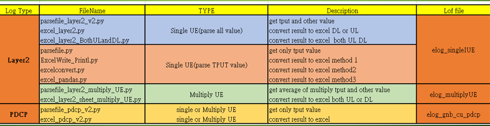
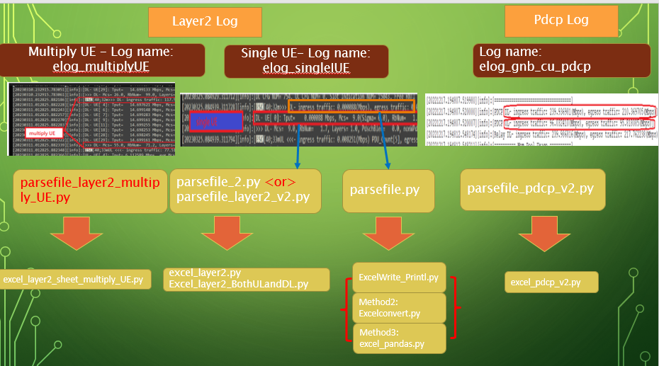

## Split and Flex CDU parser logfile
This is an automation of parsing the log file to get `UL/DL`(UL for Upload, DL for Download) related parameter or string with different CDU system: 
- Split: Using Ubuntu 16.04, not able to change Layer1 setting(L1 are from itri)
- Flex: using Centos, Layer1 implement by our developer team, and can run better 256 qam performance. 

There're two types of code one is `Layer2 log` and `PDCP` log.  Below I will show you the log file information. 

## Log File Structure:
Let me show different Log type in this project. 
### Log: Layer2 

- **Split CDU**
Layer2 Log parse `single UE` and `Multiply UE`, which contain these field Uplink, Downlink or both traffic data. 

	- Single CDU or Specfic ID: 
		- parse these item: datetime, ingress Tput, egress Tput, MCS, PuschBler,nonWPuschBler
			- `UL or DL`: datetime, Tput
			- `UL`: datetime, Tput, MCS,PuschBler,nonWPuschBler
			- `DL`: datetime, Tput, MCS,PdschBler,nonWPdschBler
	- Multiply UE: 
		- parse these item: datetime, ingress Tput, egress Tput, MCS, PuschBler,nonWPuschBler
			- `UL`: datetime, ingress Tput, egress Tput, MCS,PuschBler,nonWPuschBler
			- `DL`: datetime, ingress Tput, egress Tput, MCS,PdschBler,nonWPdschBler
	- PDCP Parameter: 
		- datetime,ingress traffic, and egress traffic
- **Flex CDU**
Layer2 Log parse `single UE` Uplink, Downlink and both traffic data

### Log: PDCP

- **Split CDU**
PDCP log will record both DL and UL traffic. Ask you can see below there are ingress and egress paramter string, I will parse the Tput of both string. 

I will parse `DL` and `UL` realted string, but there is one special string that is differnt for UL and DL that is Bler:
	- `UL`: PuschBler nonWDuschBler
    - `DL`: PdschBler nonWPdschBler

