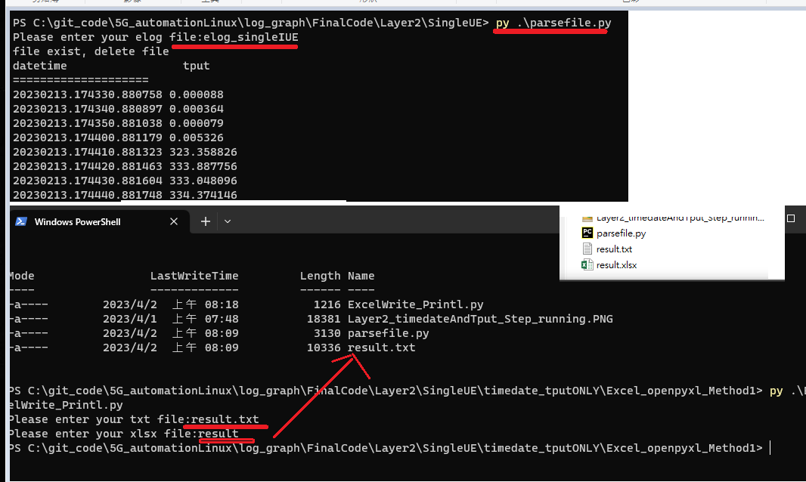
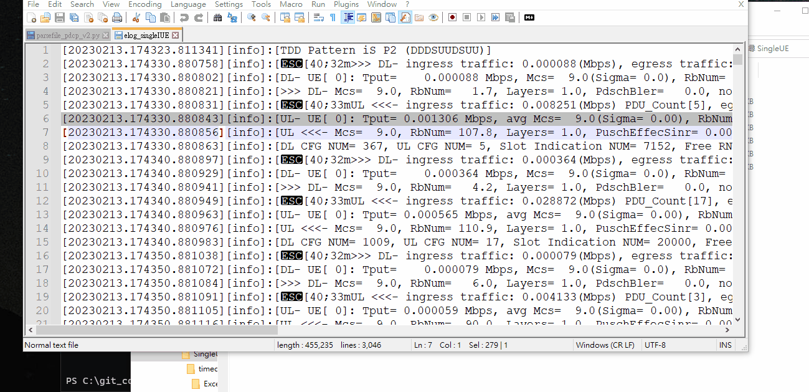
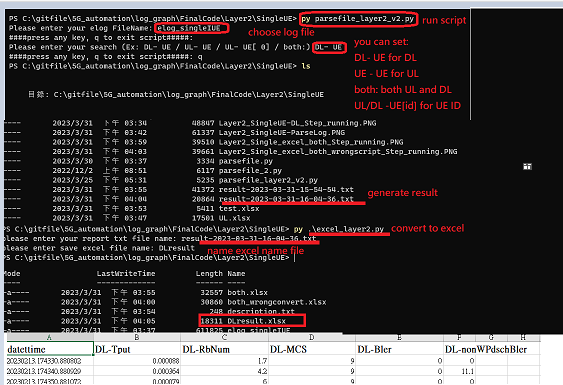
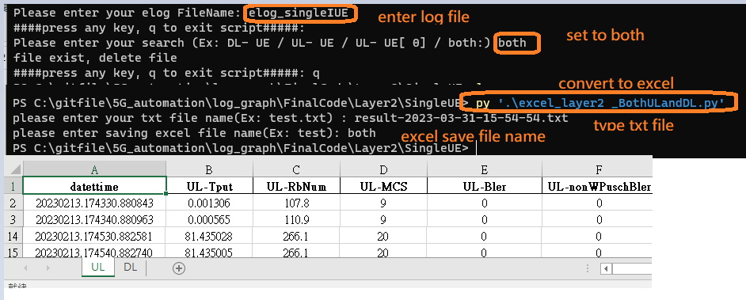
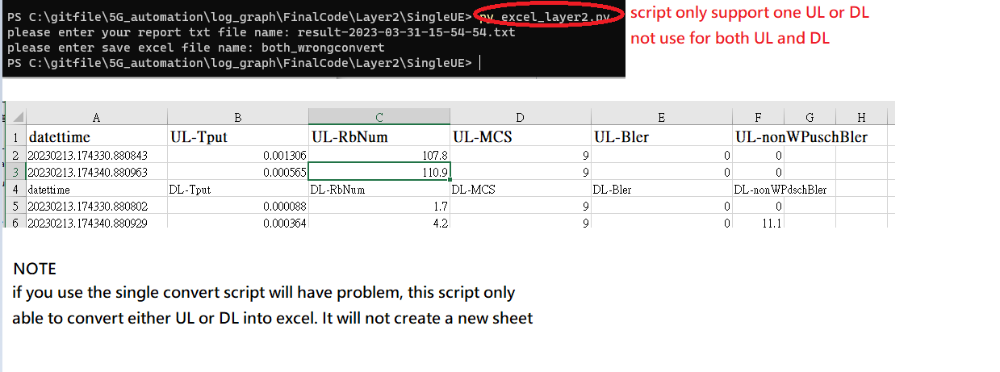
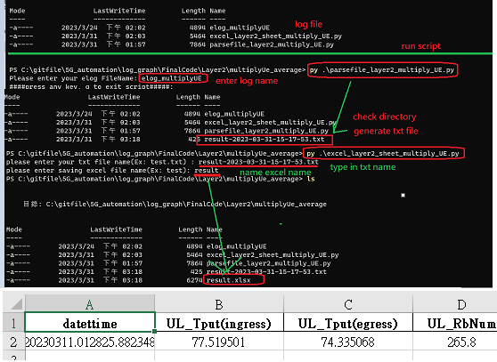
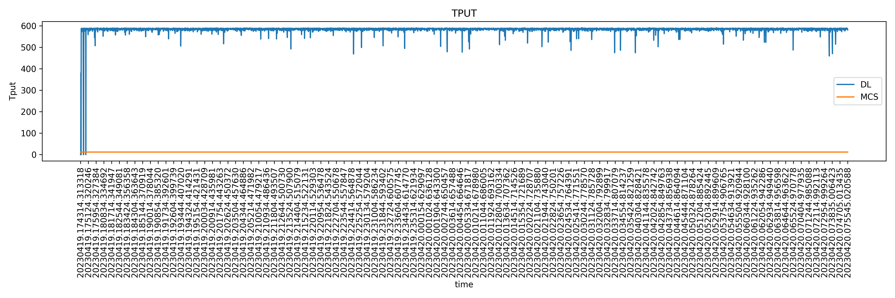

# Description of Layer2 parsing detail 
**How to run each procedure**
- Step 1: Put your log into the directory
  - I have placed the related log into LogFile 
  `Note:` If you have multiple elog files, you can use this code to merge them into one file
- Step 2.1 [Single UE] run the script to parse the log's related parameter String like this: 
  - Single UE time and tput: 
    > `20221018.234547.824204 0.656478` 
  - Single UE timedate Tput MCS Bler and etc: 
    > `datettime UL-Tput UL-RbNum UL-MCS UL-Bler UL-nonWPuschBler`
    `datettime DL-Tput DL-RbNum DL-MCS DL-Bler UL-nonWPdschBler`
    `20230213.174330.880843 0.001306 107.8 9.0 0.0 0.0 `

- Step 2.2 [Multiply UE] timedate Tput MCS Bler and etc: 
    > `datettime DL_Tput(ingress) DL_Tput(egress) DL_RbNum DL_MCS DL_Bler DL_nonWdBler`
    `datettime UL_Tput(ingress) UL_Tput(egress) UL_RbNum UL_MCS UL_Bler UL_nonWuBler`
    `20230311.012825.882186 117.590118 120.919250 71.2 55.0 2.1 1.9`
	
- Step 3: convert the txt file result into Excel file in step 2.1 or step 2.2

<a name="toc"></a>
## Table of Content
- [1. Single UE parsing log](#1)
	- [1.1 Layer 2 Single UE get only Tput Value](#1.1)
	- [1.2 Layer 2 Single UE get related string](#1.2)
		- [Case1: Get either DL or UL or `specfic DL/Ul ID](#1.2case1)
		- [Case2: Get either `DL` or `UL` or `specfic DL/Ul ID`](#Case 2: Get both DL and UL string)
- [2. Multiple UE parsing log](#2)
- [3. Merge Multiple Elog into one log file ](#3)
- [4. Plot Excel data into a visualization](#4)

<a name="1"></a>
## 1. Single UE parsing log[🔝](#toc)
<a name="1.1"></a>
### 1.1 Layer 2 Single UE get only Tput Value (ONLY DL)[🔝](#toc)

In this example, I `hotcode` the parsing parameter `ONLY DL`, you can change it. I will describe the code below.
You can use Example2 as below, which is more flexible get `DL`, `Ul` or `both Ul and DL`. 

#### File Description:
- Path: `/FinalCode/Layer2/SingleUE/timedate_tputONLY`
- `parsefile.py`: parse the log into a text file
  - `ExcelWrite_Printl.py`: convert the txt file into Excel method 1

I have also written another method of converting Excel:
- `Excel_openpyxl_Method2/excelconvert.py`: convert the txt file into Excel method2 
- `ExcelPandasMethod/excel_pandas.py`: convert the text file into Excel using the pandas method

#### How to run it
- Step1: parse the log => `./parsefile.py`
- Step2: convert generate txt file to excel => `./ExcelWrite_Printl.py`
 

#### Code Description and Note
- Hotcode only DL to search specfic string: givenString = "DL- ingress traffic"
- Parse the string tput and the Tput value 
  ```
    datestr = data.split('[', 1)[1].split(']')[0]
    Tput = data.split(" DL- ingress traffic:", 1)[1].split(',')[0].split('(')[0].strip()
  ```
- Save the result into a list  
  ```
    result.clear() #clear all list element
    result.append(datestr) #save datetime to list   
    result.append(Tput) #save tput into list
  ```

- Print the result list after parsing :
  There are many different methods to write txt file as below:
  > listprint() #write file =>ok
  > listprint2() #print =>ok
  > listprint_Method2()  # write file =>ok
  > listprint_Method3()  # write file =>ok
  > listprint_Method4()

<a name="1.2"></a>
### 1.2 Layer 2 Single UE get related string[🔝](#toc)

In this example I will get this paramter string: `datettime Tput RbNum UL-MCS UL-Bler UL-nonWPuschBler`
- Path: `/FinalCode/Layer2/SingleUE/`
 
  
My code will ask you to select these options:
- `DL -UE ': parse only Downlink String
- `UL -UE`: parse only Uplink String
- `both`: parse only both UL and Downlink String
- `DL -UE[ id]`: parse specfic UE's ID String      

<a name="1.2case1"></a>
#### `Case1`: Get either `DL` or `UL` or `specfic DL/Ul ID`

- Step1: parse the log => `parsefile_layer2_v2.py`
- Step2: convert generate txt file to excel => `./ExcelWrite_Printl.py`

 
   
<a name="1.2case2"></a>
#### Case 2: Get both DL and UL string

- Step1: same as above Step1  =>`parsefile_layer2_v2.py` 
- Step2: convert generate txt file to excel => `./excel_layer2_BothULandDL.py`



If you use `Case1` result and convert using `Case2's` excel convert script `excel_layer2_BothULandDL.py` will have a problem. 

Please refer picture below, as you can see if you convert excel DL needs to scroll down to find it and will not be bold.


#### Code Description and Note
- Filter specific UE ID like `[ 0]` or `[10]`
```
#not work
accepted_strings = re.compile(r"([DU]L\-\ UE(\[\ (\d)\])?)|both$") #only work with space [ 0] or  [ 1]
accepted_strings = re.compile(r"([DU]L\-\ UE(\[\ {0,1}(\d)\])?)|both$") #will work with [ 01] but [11] not work

#chnage to this will work
`re.compile(r"([DU]L\-\ UE(\[\s*(\d{1,2})\])?)|both$")`
```

- excel method 1:
```
      while line:
          list123 = line.split()  # convert        
          if "=" in line:
              pass            
              #list123 = line.split(sep=' ')  # convert,
          else:
          #print(line)
          #if not "=" in line:           
              if list123[1] == 'Tput':
                  sheet[0].append(list123)  # write into excel
              elif list123[1] == 'DL-Tput':
                  sheet[0].append(list123)  # write into excel
              elif list123[1] == 'UL-Tput':
                  sheet[0].append(list123)  # write into excel                                       
              else:
                  list123[1] = float(list123[1])
                  list123[2] = float(list123[2])
                  list123[3] = float(list123[3])
                  list123[4] = float(list123[4])
                  list123[5] = float(list123[5])
                  sheet[0].append(list123)  # write into excel
    
                  #excel cell's font
                  sheet[0]['A1'] .font = Font(size = 14, bold = True)
                  sheet[0]['B1'].font = Font(size = 14, bold = True)
                  sheet[0]['C1'].font = Font(size = 14, bold = True)
                  sheet[0]['D1'].font = Font(size = 14, bold = True)
                  sheet[0]['E1'].font = Font(size = 14, bold = True)
                  sheet[0]['F1'].font = Font(size = 14, bold = True)
```
- excel pandas method:
  ```
  df1 = pd.DataFrame(ULlist)
  df1 = df1.rename(columns=df1.iloc[0]).drop(df1.index[0])
  df1['ingress-traffic'] = df1['ingress-traffic'].astype(float)
  df1['egress-traffic'] = df1['egress-traffic'].astype(float)
  ```
  Change format styling 
  ```
  df1=df1.style.set_properties(**{'text-align': 'center'})
  df2=df2.style.set_properties(**{'text-align': 'center'})
  ```
<a name="2"></a>  
## 2. Multiple UE parsing log[🔝](#toc)
**Description:** Layer 2 Multiply UE gets related String

In this example, I will get this parameter string: `datettime DL_Tput(ingress) DL_Tput(egress) DL_RbNum DL_MCS DL_Bler DL_nonWdBler`

- Path: `/FinalCode/Layer2/multiplyUe_average/`

### File Description:
  - `parsefile_layer2_multiply_UE.py`: parse the log into txt file
  - `excel_layer2_sheet_multiply_UE.py`: convert the text file into Excel

### How to run it 
- Step1: parse the log => `./parsefile_layer2_multiply_UE.py`
- Step2: convert generate txt file to excel => `./excel_layer2_sheet_multiply_UE.py`


### Code Description and Note
- get Tput value 
```
Tputvalue=re.search(r'(ingress [^(]+).+(egress [^(]+)',data)
m3New= Tputvalue.group(1)+", "+ Tputvalue.group(2) 
m3New_1=m3New.replace(", ", ":").strip().split(':')
```
- using regular expression to get the MCS MCS-related string date and time
	- DL: `re.search(r'\[(\d+\.\d+\.\d+)\].*?(>>> DL- Mcs=[^]]+)', line)`
    - UL: `re.search(r'\[(\d+\.\d+\.\d+)\].*?(UL <<<- Mcs=[^]]+)', nextline):`

<a name="3"></a>
## 3. Merge Multiple Elog into one log file[🔝](#toc)
**Description:** If you have multiple elog, especially running overnight or overweekend will contain multiple elog files. In this situation, you can instead merge multiple elog into one log file. 

- Filename: `merge_multiply_elogfile.py`
- Path: `/FinalCode/Layer2/`

### Method 1: using `read and write`

```
#path
directory = "."
# Output file name
output_file = "merged.txt"
with open(output_file, "w") as outfile:
    for filename in os.listdir(directory):
        if filename.startswith("elog_gnb_du_layer2"):
            with open(os.path.join(directory, filename), "r") as infile:
                outfile.write(infile.read())
```
	
### Method 2: using `glob` library
```
file_pattern = 'elog_gnb_du_layer2*'
file_list = glob.glob(file_pattern)
	with open('merged_file.txt', 'w') as outfile:
        for file in file_list:
            with open(file, 'r') as infile:
                outfile.write(infile.read())
```

- fix some issue, reading file in order: If your file is name XXX_8.txt,XXX_9.txt, XXX_10.txt, it will read like 10, 8, 9. to fix this issue, add `natsort`

```
from natsort import natsorted
def method3():
	file_pattern = 'elog_gnb_du_layer2*'
	file_list = glob.glob(file_pattern)
	sorted_file_list = natsorted(file_list)  # Sort the file list naturally
		with open('merged_file.txt', 'w') as outfile:
			for file in sorted_file_list:
				with open(file, 'r') as infile:
    	outfile.write(infile.read())
```
<a name="4"></a>
## 4. Plot Excel data into a visualization[🔝](#toc)
**Description:** After you have Done parsing the file and export to excel, you can run below either script to generate data visualization draw line graph and save pic

Draw line graph using `matplotlib.pyplot`(2022-06 update new feature)
- New Add draw graph TPUT ONLY
- New Add draw graph TPUT and MCS 


### FileDescription:
- `chart_TPUT_MCS.py`: excel only contain TPUT and MCS column

- `chart_TPUT_only.py`: excel only contain TPUT only 
- Path: `/FinalCode/Layer2/drawLineGraph`